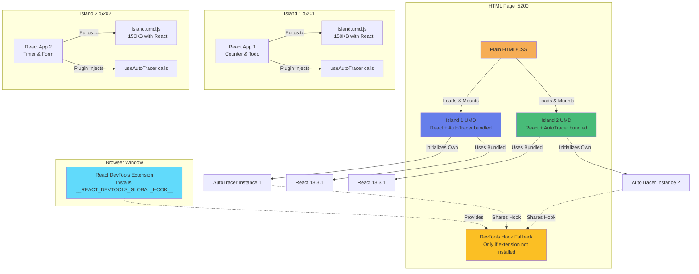

# React Islands Architecture Demo with AutoTracer

This demo showcases **truly independent React islands** - multiple React applications that bundle their own React and AutoTracer, requiring zero coordination from the host page beyond a simple DevTools hook (which the React DevTools browser extension provides automatically).

## What Makes This Special

**Each island is completely self-contained:**
- ✅ Bundles its own React + ReactDOM + AutoTracer
- ✅ No shared dependencies with the host page
- ✅ No coordination required (works with React DevTools installed)
- ✅ Developer can build and trace their island independently
- ✅ Perfect for CMS scenarios where island developers don't control the host page

**Real-world use case:** A developer building a React widget for a CMS can develop with full AutoTracer observability without requiring any setup from the CMS administrators. Just drop in the UMD bundle and it works.

## Architecture Overview



## Key Insight: The DevTools Hook

The **only** coordination needed between islands is the `__REACT_DEVTOOLS_GLOBAL_HOOK__`. This hook:

1. **Usually provided by React DevTools extension** - If your developers have the React DevTools browser extension (which they should), the hook is automatically installed. No setup needed!

2. **Fallback in the loader** - The demo page includes a fallback hook for developers without the extension. This is the minimal coordination required.

3. **Shared across React instances** - Multiple React instances (one per island) all use the same hook to report their renders to AutoTracer.

**Bottom line:** In real-world usage with React DevTools installed, islands are **truly independent** with zero host page requirements.

## Applications

### 1. Loader (`example-islands-loader`)

- **Port**: 5200
- **Type**: Plain HTML page served by Vite
- **Purpose**: Loads and orchestrates both React islands
- **Responsibilities**:
  - Initializes AutoTracer once for the entire page
  - Loads React and ReactDOM from CDN
  - Loads each island's UMD bundle
  - Mounts islands to specific DOM nodes

### 2. Island 1 (`example-islands-react1`)

- **Port**: 5201 (dev server for standalone mode)
- **Purpose**: Counter & Todo List components
- **Features**:
  - Builds to UMD format exposing `Island1.mount()`
  - Can run standalone for development
  - Automatic AutoTracer instrumentation via Vite plugin
- **State Labels**: `count`, `todos`, `input`, `showCounter`, `showTodos`

### 3. Island 2 (`example-islands-react2`)

- **Port**: 5202 (dev server for standalone mode)
- **Purpose**: Timer & Form components
- **Features**:
  - Builds to UMD format exposing `Island2.mount()`
  - Can run standalone for development
  - Automatic AutoTracer instrumentation via Vite plugin
- **State Labels**: `seconds`, `isRunning`, `name`, `email`, `submitted`, `showTimer`, `showForm`

## Technology Stack

- **Loader**: Plain HTML + Vite dev server
- **Islands**: React 18.3.1 + TypeScript
- **Build Tool**: Vite 5.3.3 (UMD library mode)
- **Tracing**: @auto-tracer/react18 (workspace package)
- **Instrumentation**: @auto-tracer/plugin-vite-react18 (automatic injection)
- **Dependencies**: Each island bundles React 18.3.1 + ReactDOM + AutoTracer (~150KB per island)

## Quick Start

### Prerequisites

**Install React DevTools browser extension** (recommended):
- [Chrome Web Store](https://chrome.google.com/webstore/detail/react-developer-tools/fmkadmapgofadopljbjfkapdkoienihi)
- [Firefox Add-ons](https://addons.mozilla.org/en-US/firefox/addon/react-devtools/)

With the extension installed, islands work with zero host page setup!

### Running the Demo

```bash
# From repository root

# 1. Build both islands
pnpm build:islands

# 2. Run preview servers
pnpm preview:islands
```

**Then open**: http://localhost:5200

You'll see:
- Both islands mount and render
- AutoTracer logs for all component renders
- Separate React renderer IDs for each island
- Shared render cycle counter (both islands use the same AutoTracer global state)

### Development Mode Note

**Dev mode doesn't work** (`pnpm dev:islands`) because:
- Dev servers serve source files with HMR, not built UMD bundles
- The loader expects `island.umd.js` files from the dist folders
- Use `build` + `preview` workflow for the islands demo

**For standalone island development:**
```bash
pnpm --filter example-islands-react1 dev
# Open http://localhost:5201 - island runs standalone with full tracing
```

## How It Works

### UMD Build Configuration

Each island bundles **everything** it needs:

```typescript
// vite.config.ts
build: {
  lib: {
    entry: 'src/mount.tsx',
    name: 'Island1',
    formats: ['umd'],
    fileName: () => 'island.umd.js',
  },
  rollupOptions: {
    external: [],  // Bundle everything - no externals!
    // React, ReactDOM, and AutoTracer are bundled into the UMD
  }
}
```

**Key configuration:**
- `external: []` - Don't externalize anything, bundle all dependencies
- `buildWithWorkspaceLibs: false` - Don't use the Vite plugin's shared dependency mode
- Result: ~150KB UMD bundle including React + ReactDOM + AutoTracer

### AutoTracer Plugin During Build

The Vite plugin runs during build and:
- Injects `useAutoTracer()` calls into every component
- Labels all `useState` and `useReducer` hooks with variable names
- Transforms happen before UMD bundling, so the instrumented code is in the final bundle

### Island Mount Function

Each island exposes a global `mount()` function:

   ```typescript
   // src/mount.tsx
   export function mount(elementId: string) {
     // Initialize this island's AutoTracer instance
     autoTracer({
       enabled: true,
       enableAutoTracerInternalsLogging: false,
       includeNonTrackedBranches: false
     })

     const container = document.getElementById(elementId)
     const root = createRoot(container)
     root.render(<App />)
   }
   ```

**Important:** Each island calls `autoTracer()`, but only the first call actually initializes (AutoTracer is a singleton). Subsequent calls are safely ignored.

### Loading Sequence in the HTML

```html
<!-- 1. DevTools Hook (fallback if extension not installed) -->
<script>
  if (!window.__REACT_DEVTOOLS_GLOBAL_HOOK__) {
    window.__REACT_DEVTOOLS_GLOBAL_HOOK__ = {
      supportsFiber: true,
      renderers: new Map(),
      onCommitFiberRoot() {},
      inject(renderer) { return Math.random().toString(16).slice(2); }
    };
  }
</script>

<!-- 2. Load Island 1 UMD (contains React + AutoTracer) -->
<script src="http://localhost:5201/island.umd.js"></script>
<script>
  window.Island1.mount('island-1');  // Initializes AutoTracer
</script>

<!-- 3. Load Island 2 UMD (contains React + AutoTracer) -->
<script src="http://localhost:5202/island.umd.js"></script>
<script>
  window.Island2.mount('island-2');  // AutoTracer already initialized, no-op
</script>
```

**Key points:**
- No CDN loading of React - each island brings its own
- No shared AutoTracer UMD - each island bundles it
- Hook is the only coordination needed (and React DevTools provides it automatically)

## What You Get

### Console Output

When you load the demo page with React DevTools installed, you'll see:

```
Component render cycle 1:
├─ [App] Mount ⚡
│   Initial state count: 0
│   Initial state todos: []
│   Initial state input:
│   Initial state showCounter: true
│   Initial state showTodos: true

Component render cycle 2 (1 filtered):
├─ [App] Mount ⚡
│   Initial state seconds: 0
│   Initial state isRunning: false
│   Initial state name:
│   Initial state email:
│   Initial state submitted: false
│   Initial state showTimer: true
│   Initial state showForm: true

Component render cycle 3 (1 filtered):
├─ [App] Rendering ⚡
│   State change count: 0 → 1
```

**Notice:**
- Render cycles are shared across both islands (3, 4, 5...)
- Each island has its own React renderer ID (visible in DevTools hook logs if enabled)
- State changes from both islands appear in one unified log
- AutoTracer is a singleton even though each island bundles it

### Multiple React Instances, One AutoTracer

**What's happening under the hood:**
1. Island 1 loads → Its bundled React creates renderer #1
2. Island 1's AutoTracer initializes and installs the render hook
3. Island 2 loads → Its bundled React creates renderer #2
4. Island 2's AutoTracer init call is ignored (already initialized)
5. Both React instances use the same DevTools hook
6. AutoTracer sees renders from both via the shared hook

This is **intentional** - it gives unified observability across independent islands.

## Key Demonstration Points

### 1. True Independence

✅ **Each Island Bundles Everything**: React + ReactDOM + AutoTracer all included<br>
✅ **No Shared Dependencies**: Islands don't rely on globals from the host page<br>
✅ **Zero Configuration**: Works automatically with React DevTools extension<br>
✅ **Real-World Ready**: Island developer needs no coordination with CMS admins

### 2. UMD Build Format

✅ **Browser-Compatible**: UMD works in browsers without bundlers<br>
✅ **Global Variables**: Islands expose `window.Island1` and `window.Island2`<br>
✅ **No External Tooling**: Just `<script>` tags to load<br>
✅ **Self-Contained**: Each bundle is ~150KB with all dependencies

### 3. Independent Island Development

✅ **Standalone Mode**: Each island runs independently during development<br>
✅ **Own Dev Server**: Islands can be developed in isolation<br>
✅ **Automatic Instrumentation**: Plugin injects AutoTracer without code changes<br>
✅ **Test Harness Included**: Each island has its own `index.html` for standalone testing

### 4. Islands Architecture Benefits

✅ **Progressive Enhancement**: HTML loads first, islands enhance progressively<br>
✅ **True Isolation**: Each island could use different React versions (advanced)<br>
✅ **Script-Tag Simple**: No bundler or build tool needed on the host page<br>
✅ **Unified Observability**: See all component renders in one trace log

## Development Workflow

### Typical CMS/Islands Use Case

Imagine you're building a React widget for a CMS (WordPress, Drupal, etc.):

1. **Develop your island standalone:**
   ```bash
   cd apps/example-islands-react1
   pnpm dev
   # Opens http://localhost:5201 with full AutoTracer observability
   ```

2. **Make changes, see traces immediately:**
   - Add components, hooks, state
   - AutoTracer plugin automatically instruments everything
   - Console shows all renders, state changes, component logs

3. **Build for production:**
   ```bash
   pnpm build
   # Creates dist/island.umd.js (~150KB)
   ```

4. **Deploy to CMS:**
   - Upload `island.umd.js` to your CDN
   - Add to page template:
     ```html
     <div id="my-widget"></div>
     <script src="https://cdn.example.com/island.umd.js"></script>
     <script>window.Island1.mount('my-widget');</script>
     ```

5. **Debug in production:**
   - Install React DevTools extension
   - Full AutoTracer observability without any CMS configuration!

### Making Changes

1. Run island in standalone mode
2. Edit components in `src/`
3. See HMR updates with tracing
4. When ready: `pnpm build`
5. Test with loader page: `pnpm build:islands && pnpm preview:islands`

## Real-World Considerations

### React DevTools Extension

**Strongly recommended** for all developers. Benefits:
- ✅ Automatic DevTools hook installation
- ✅ Full component tree inspection
- ✅ Props/state debugging
- ✅ Profiler for performance analysis
- ✅ **Required for AutoTracer to work without manual hook setup**

Without the extension, you need the fallback hook (shown in the demo loader).

### Bundle Size

Each island is ~150KB (React + ReactDOM + AutoTracer):
- **Downside**: Some duplication if multiple islands on same page
- **Upside**: Complete independence, zero coordination
- **Trade-off**: For 2-3 islands, independence is worth the cost
- **Optimization**: For many islands, consider a shared React approach (see Microfrontend demo)

### Production Optimization

For production use:

1. **Minification**: Already enabled in Vite build (production mode)
2. **Cache headers**: Set long cache TTLs (365 days) with content hashing
3. **CDN hosting**: Serve bundles from CDN for best performance
4. **Lazy loading**: Load islands on demand (Intersection Observer)
5. **Error boundaries**: Wrap each island to prevent cascade failures

```html
<!-- Production example with cache busting -->
<script src="https://cdn.example.com/island1.a8f3d9.umd.js"></script>
```

### AutoTracer in Production

Consider your strategy:
- **Dev/Test/QA only**: Use environment checks to disable in production
- **QA/Staging observability**: Keep AutoTracer enabled in test environments for debugging
- **Conditional**: Only initialize in non-production environments

Current demo keeps it enabled to show the pattern works end-to-end.

## Comparison with Microfrontend Demo

| Aspect | Islands Demo | Microfrontend Demo |
|--------|--------------|-------------------|
| **Loading** | Script tags in HTML | Module Federation |
| **Format** | UMD bundles (~150KB each) | ESM modules (shared React) |
| **Dependencies** | Bundled (independent) | Shared (federated) |
| **Page Type** | Static HTML | React SPA |
| **Dev Mode** | Build + preview required | Full HMR support |
| **Use Case** | CMS widgets, content sites | Enterprise app composition |
| **Coordination** | Minimal (just DevTools hook) | Tight (shared dependencies) |
| **Bundle Size** | Duplicated React per island | Shared React across remotes |

**When to use Islands:**
- Building widgets for third-party sites (CMSs, marketing pages)
- Need complete independence
- Script-tag deployment
- 2-3 islands max on same page

**When to use Microfrontends:**
- Building unified applications from multiple teams
- Want shared dependencies
- Many remotes on same page
- Need hot reload during development

## Related Documentation

- [Islands Architecture Pattern](https://jasonformat.com/islands-architecture/)
- [Vite Library Mode](https://vitejs.dev/guide/build.html#library-mode)
- [@auto-tracer/react18 Package](../../packages/auto-tracer-react18/README.md)
- [@auto-tracer/plugin-vite-react18 Package](../../packages/auto-tracer-plugin-vite-react18/README.md)
- [Microfrontend Demo](./MICROFRONTEND-README.md)
4. When ready: `pnpm build`
5. Test with loader page: `pnpm build:islands && pnpm preview:islands`

## Expected Console Output

```
🏝️ AutoTracer initialized for islands architecture
🟦 Island 1 mounted
🟩 Island 2 mounted
AutoTracer: Global render monitor initialized
Component render cycle 1:
├─ [App] Mount ⚡
│   Initial state count: 0
│   Initial state todos: []
...
```

## What This Demo Proves

✅ **Islands architecture works with AutoTracer**<br>
✅ **UMD format enables script-tag loading**<br>
✅ **Multiple independent React apps can share AutoTracer**<br>
✅ **Automatic instrumentation survives UMD bundling**<br>
✅ **No bundler required** - plain HTML + script tags work<br>
✅ **Full observability across islands** - see every render in one log

## Differences from Microfrontend Demo

| Aspect | Islands Demo | Microfrontend Demo |
|--------|--------------|-------------------|
| Loading | Script tags in HTML | Module Federation runtime |
| Format | UMD bundles | ESM modules |
| Runtime | Browser globals | Module Federation container |
| Page Type | Static HTML | React SPA |
| Dev Mode | Build required | HMR works |
| Use Case | Content sites | App composition |

## Production Considerations

### For Real Production Use:

1. **CDN Hosting**: Host UMD bundles on CDN
2. **Cache Busting**: Add content hashes to filenames
3. **Lazy Loading**: Load islands on demand (Intersection Observer)
4. **Minification**: Use production builds with minification
5. **Error Boundaries**: Wrap each island in error boundary
6. **Loading States**: Show spinners while islands load

### Example Production HTML:

```html
<!-- Production CDN versions -->
<script crossorigin src="https://unpkg.com/react@18/umd/react.production.min.js"></script>
<script crossorigin src="https://unpkg.com/react-dom@18/umd/react-dom.production.min.js"></script>

<!-- Your islands from CDN -->
<script src="https://cdn.yoursite.com/islands/island1.abc123.umd.js"></script>
<script src="https://cdn.yoursite.com/islands/island2.def456.umd.js"></script>
```

## Related Documentation

- [Islands Architecture](https://jasonformat.com/islands-architecture/)
- [Vite Library Mode](https://vitejs.dev/guide/build.html#library-mode)
- [@auto-tracer/react18 Package](../../packages/auto-tracer-react18/README.md)
- [@auto-tracer/plugin-vite-react18 Package](../../packages/auto-tracer-plugin-vite-react18/README.md)
- [UMD Format](https://github.com/umdjs/umd)
