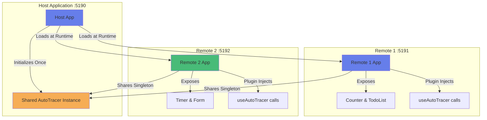

# Microfrontend AutoTracer Demo Suite

This is a **working microfrontend application** demonstrating AutoTracer integration in Module Federation architectures. The suite consists of one host application that dynamically loads two remote microfrontends using the official `@module-federation/vite` plugin.

## Architecture Overview



## Applications

### 1. Host Application (`example-microfrontend-host`)

- **Port**: 5190
- **Purpose**: Main application that loads remotes
- **Features**:
  - Host-level state and controls
  - Dynamic loading/unloading of remotes
  - AutoTracer integration for host components
- **README**: [apps/example-microfrontend-host/README.md](./example-microfrontend-host/README.md)

### 2. Remote 1 (`example-microfrontend-remote1`)

- **Port**: 5191
- **Purpose**: First remote microfrontend
- **Features**:
  - Counter component with labeled state
  - TodoList component with input handling
  - Can run standalone or as remote
- **README**: [apps/example-microfrontend-remote1/README.md](./example-microfrontend-remote1/README.md)

### 3. Remote 2 (`example-microfrontend-remote2`)

- **Port**: 5192
- **Purpose**: Second remote microfrontend
- **Features**:
  - Timer component with useEffect
  - Form component with multiple inputs
  - Can run standalone or as remote
- **README**: [apps/example-microfrontend-remote2/README.md](./example-microfrontend-remote2/README.md)

## Technology Stack

- **Framework**: React 18.3.1
- **Build Tool**: Vite 5.3.3
- **Module Federation**: @module-federation/vite (official plugin)
- **Tracing**: @auto-tracer/react18 (workspace package)
- **Instrumentation**: @auto-tracer/plugin-vite-react18 (automatic injection)
- **Language**: TypeScript with strict settings

## Quick Start

### Running All Apps in Development (Single Command)

```bash
pnpm dev:microfrontend
```

This command uses Turborepo to:

1. Build all dependency packages first
2. Start all three apps simultaneously in dev mode with HMR
3. Each app runs with its own Vite dev server

**Then open**: http://localhost:5190

**All apps run in full dev mode with hot module replacement (HMR)**:

- Host on port 5190 (loads remotes)
- Remote 1 on port 5191 (Counter & TodoList)
- Remote 2 on port 5192 (Timer & Form)

### Running Individual Apps (Standalone)

Each remote can run independently for development:

```bash
# Remote 1 standalone
pnpm --filter example-microfrontend-remote1 dev
# Open http://localhost:5191

# Remote 2 standalone
pnpm --filter example-microfrontend-remote2 dev
# Open http://localhost:5192
```

**Note**: When running remotes standalone, they initialize their own AutoTracer instance. When loaded via the host, they share the host's singleton instance.

### Building

Build all three apps:

```bash
pnpm --filter example-microfrontend-host build
pnpm --filter example-microfrontend-remote1 build
pnpm --filter example-microfrontend-remote2 build
```

## Key Demonstration Points

### 1. Singleton Shared AutoTracer Instance

**Current Setup**: Single AutoTracer instance shared across all apps

- Host initializes AutoTracer **once** before rendering
- React, ReactDOM, and `@auto-tracer/react18` are configured as **singletons** in Module Federation
- All three apps share the same AutoTracer instance
- Remote components automatically use the host's AutoTracer

**What This Demonstrates**:

✅ **Unified Observability**: AutoTracer sees all component renders across the entire federated application as one cohesive React tree<br>
✅ **No Interference**: Single shared instance eliminates conflicts between multiple trackers<br>
✅ **Seamless Integration**: Remote components trace exactly like local components<br>
✅ **Proper Isolation**: Each app's React instance is shared, maintaining proper context and hooks behavior

### 2. Automatic Instrumentation via Vite Plugin

**Instrumentation Approach**:

- **Host**: Manual instrumentation with explicit `useAutoTracer()` and `logger.labelState()` calls
- **Remote 1 & 2**: Automatic injection via `@auto-tracer/plugin-vite-react18` Vite plugin

**What This Demonstrates**:

✅ **Plugin Transforms First**: AutoTracer plugin runs before Module Federation plugin in the build pipeline<br>
✅ **Zero Code Changes**: Remote components need no AutoTracer imports or hooks - fully automatic<br>
✅ **Labeled State**: Plugin automatically labels all `useState` and `useReducer` calls<br>
✅ **Both Approaches Work**: Manual and automatic instrumentation coexist seamlessly

### 3. State Tracking Across Federation Boundaries

**Observable Behaviors**:

1. **Host State Changes**: Host counter, remote visibility toggles all tracked
2. **Remote State Changes**: Counter, todos, timer, form inputs all tracked independently
3. **Mount/Unmount**: Traces visible when toggling remotes on/off
4. **Effect-based Updates**: Timer in Remote 2 updates via `useEffect` are tracked

**What This Demonstrates**:

✅ **Complete Visibility**: Every state change in every app is visible in one unified trace log<br>
✅ **Clear Attribution**: State labels clearly identify which component/app owns the state<br>
✅ **Lifecycle Events**: Mount, update, and unmount all generate appropriate traces<br>
✅ **No Boundary Issues**: Federation boundaries are transparent to the tracing system

### 4. Module Federation Configuration

All components use labeled state for clear identification:

- **Host**: `hostCounter`, `showRemote1`, `showRemote2`
- **Remote 1**: `count`, `todos`, `input`, `showCounter`, `showTodos`
- **Remote 2**: `seconds`, `isRunning`, `name`, `email`, `submitted`, `showTimer`, `showForm`

**Critical Configuration Details**:

- **Remote Type**: Must use `type: 'module'` (not `'var'`) for ESM compatibility
- **Manifest**: Remotes must set `manifest: true` in federation config
- **Server Origin**: All apps must set `server.origin` and `base` for proper URL resolution
- **Shared Singletons**: React, ReactDOM, and AutoTracer must all be `singleton: true`

## Module Federation Configuration Details

### Shared Modules (Host Configuration)

```typescript
shared: {
  react: {
    singleton: true,
    requiredVersion: '^18.3.1'
  },
  'react-dom': {
    singleton: true,
    requiredVersion: '^18.3.1'
  },
  '@auto-tracer/react18': {
    singleton: true
  }
}
```

### Remote Configuration Requirements

**Remote Apps Must Configure**:

```typescript
federation({
  name: "remote1", // or 'remote2'
  filename: "remoteEntry.js",
  manifest: true, // REQUIRED for dev mode
  exposes: {
    "./App": "./src/App.tsx",
  },
  shared: {
    react: { singleton: true, requiredVersion: "^18.3.1" },
    "react-dom": { singleton: true, requiredVersion: "^18.3.1" },
    "@auto-tracer/react18": { singleton: true },
  },
});
```

**Vite Config Must Include**:

```typescript
server: {
  port: 5191, // or appropriate port
  strictPort: true,
  cors: true,
  origin: 'http://localhost:5191', // REQUIRED
},
base: 'http://localhost:5191', // REQUIRED
```

### Host Remote Loading Configuration

```typescript
remotes: {
  remote1: {
    type: 'module', // MUST be 'module' not 'var'
    name: 'remote1',
    entry: 'http://localhost:5191/remoteEntry.js',
  },
  remote2: {
    type: 'module', // MUST be 'module' not 'var'
    name: 'remote2',
    entry: 'http://localhost:5192/remoteEntry.js',
  },
}
```

### Why AutoTracer IS Shared (and Must Be)

The `@auto-tracer/react18` package **must** be shared as a singleton because:

1. **Single React DevTools Hook**: React's DevTools hook is global, and AutoTracer attaches to it
2. **Unified Trace Output**: Multiple AutoTracer instances would create separate, conflicting trace streams
3. **State Consistency**: Shared singleton ensures all components see the same tracing configuration
4. **Package Export Fix**: Added `"./package.json": "./package.json"` export to enable Module Federation resolution

## Files Structure

```
apps/
├── example-microfrontend-host/
│   ├── src/
│   │   ├── App.tsx         # Host component with remote loading
│   │   ├── main.tsx        # AutoTracer initialization
│   │   └── ...
│   ├── package.json
│   ├── vite.config.ts      # Federation config (consumer)
│   └── README.md
├── example-microfrontend-remote1/
│   ├── src/
│   │   ├── App.tsx         # Exposed component
│   │   ├── main.tsx        # Conditional AutoTracer init
│   │   └── ...
│   ├── package.json
│   ├── vite.config.ts      # Federation config (exposes ./App)
│   └── README.md
└── example-microfrontend-remote2/
    ├── src/
    │   ├── App.tsx         # Exposed component
    │   ├── main.tsx        # Conditional AutoTracer init
    │   └── ...
    ├── package.json
    ├── vite.config.ts      # Federation config (exposes ./App)
    └── README.md
```

## Development Tips

### Debugging

1. **Check Console**: AutoTracer logs are enabled with `enableAutoTracerInternalsLogging: true`
2. **Browser DevTools**: Use React DevTools to inspect component hierarchy
3. **Network Tab**: See when remote modules are loaded (look for `remoteEntry.js` requests)
4. **Port Conflicts**: Ensure all three ports (5190, 5191, 5192) are available

### Common Issues and Solutions

**"Port already in use" Errors**

- Kill existing processes:
  ```powershell
  Get-NetTCPConnection -LocalPort 5190,5191,5192 | ForEach-Object { Stop-Process -Id $_.OwningProcess -Force }
  ```
- Or use different ports in vite.config.ts

**"Cannot use import statement outside a module" for remoteEntry.js**

- **Cause**: Remote type is set to `'var'` instead of `'module'`
- **Fix**: In host config, use `type: 'module'` in remote definitions

**"Failed to get manifest" (RUNTIME-003)**

- **Cause**: Remotes running in preview mode or `manifest: true` not set
- **Fix**: Ensure remotes run with `vite` (dev mode) and have `manifest: true` in federation config

**"remoteEntryExports is undefined"**

- **Cause**: Remote type misconfigured or remoteEntry.js not loading as ES module
- **Fix**: Use object format with `type: 'module'` for all remotes

**TypeScript Errors on Remote Imports**

- The `// @ts-expect-error` comment is intentional
- Module Federation types are dynamic and not in TypeScript declarations

**AutoTracer Not Showing Traces**

- Check browser console for "AutoTracer: Global render monitor initialized"
- Verify `enabled: true` in autoTracer config
- For manual instrumentation, ensure `useAutoTracer()` is called
- For plugin instrumentation, verify plugin is listed before federation in vite config

## Testing Scenarios

### Scenario 1: Full Lifecycle

1. Start all three apps
2. Open host (5190)
3. Observe initial traces from host
4. Watch traces as remotes load
5. Interact with host controls
6. Interact with remote components

### Scenario 2: Remote Toggle

1. Hide Remote 1 using host control
2. Observe unmount traces
3. Show Remote 1 again
4. Observe re-mount traces

### Scenario 3: Standalone vs Federated

1. Run Remote 1 standalone (5191)
2. Interact and observe traces
3. Compare with traces when loaded via host

### Scenario 4: Concurrent State Changes

1. Update host counter
2. Update Remote 1 counter
3. Start Remote 2 timer
4. Observe all traces in console

## Expected Observations

When the demo is running correctly, you should see:

1. **Single Unified Trace Stream**: One AutoTracer instance logs all components from all apps
2. **Component Identification**: State labels clearly identify which component owns the state:
   - `hostCounter` = Host app
   - `count`, `todos` = Remote 1
   - `seconds`, `name`, `email` = Remote 2
3. **Mount/Unmount Events**: Visible in traces when toggling "Show Remote 1" / "Show Remote 2"
4. **All State Changes Tracked**: Every button click, input change, timer tick generates a trace
5. **Automatic Labeling**: Remote components show labeled state without any manual instrumentation code
6. **No Conflicts**: Single shared React + AutoTracer instance = clean, unified output

## What This Demo Proves

✅ **AutoTracer works seamlessly in Module Federation architectures**<br>
✅ **Singleton sharing is critical** - React, ReactDOM, and AutoTracer must all be singletons<br>
✅ **Automatic instrumentation via Vite plugin works across federation boundaries**<br>
✅ **No special code required in remote apps** - they trace automatically when loaded by host<br>
✅ **Complete observability** - see every state change across the entire federated application<br>
✅ **Production-ready pattern** - this configuration is a valid boilerplate for real microfrontend apps

## Next Steps

1. ✅ ~~Attempt to share AutoTracer instance via Module Federation~~ **COMPLETED**
2. Add E2E tests with Playwright to verify tracing behavior
3. Test with production builds
4. Document this as the recommended microfrontend setup pattern
5. Consider trace aggregation and remote logging for distributed deployments

## Related Documentation

- [Official Module Federation for Vite](https://module-federation.io/guide/basic/vite)
- [@auto-tracer/react18 Package](../../packages/auto-tracer-react18/README.md)
- [@auto-tracer/plugin-vite-react18 Package](../../packages/auto-tracer-plugin-vite-react18/README.md)
- [Module Federation Concepts](https://module-federation.io/guide/start/)
- [Troubleshooting RUNTIME-003](https://module-federation.io/guide/troubleshooting/runtime/runtime-003)
