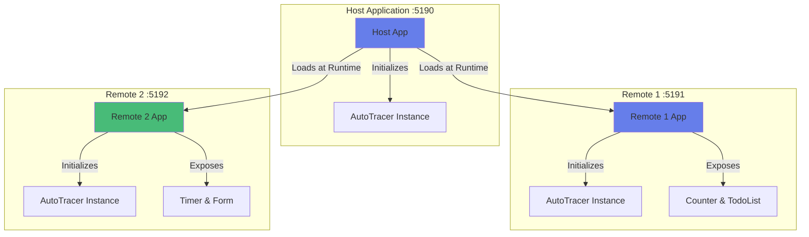

# Microfrontend AutoTracer Investigation Suite

This is a **3-headed microfrontend application** setup to investigate AutoTracer behavior in microfrontend architectures. The suite consists of one host application that dynamically loads two remote microfrontends using Vite Module Federation.

## Architecture Overview



## Applications

### 1. Host Application (`example-microfrontend-host`)
- **Port**: 5190
- **Purpose**: Main application that loads remotes
- **Features**:
  - Host-level state and controls
  - Dynamic loading/unloading of remotes
  - AutoTracer integration for host components
- **README**: [apps/example-microfrontend-host/README.md](./apps/example-microfrontend-host/README.md)

### 2. Remote 1 (`example-microfrontend-remote1`)
- **Port**: 5191
- **Purpose**: First remote microfrontend
- **Features**:
  - Counter component with labeled state
  - TodoList component with input handling
  - Can run standalone or as remote
- **README**: [apps/example-microfrontend-remote1/README.md](./apps/example-microfrontend-remote1/README.md)

### 3. Remote 2 (`example-microfrontend-remote2`)
- **Port**: 5192
- **Purpose**: Second remote microfrontend
- **Features**:
  - Timer component with useEffect
  - Form component with multiple inputs
  - Can run standalone or as remote
- **README**: [apps/example-microfrontend-remote2/README.md](./apps/example-microfrontend-remote2/README.md)

## Technology Stack

- **Framework**: React 18.3.1
- **Build Tool**: Vite 5.3.1
- **Module Federation**: @originjs/vite-plugin-federation 1.3.5
- **Tracing**: @auto-tracer/react18 (workspace package)
- **Language**: TypeScript with strict settings

## Quick Start

### Running All Apps in Development

#### Option 1: Single Command (Recommended)

Use the convenience script to run all three apps with a single command:

```bash
pnpm dev:microfrontend
```

This command:
1. Builds Remote 1 and Remote 2 (required for Module Federation)
2. Starts all three apps with `concurrently`:
   - **Blue**: Host application (dev mode)
   - **Magenta**: Remote 1 (preview mode - serving built files)
   - **Green**: Remote 2 (preview mode - serving built files)

**Then open**: http://localhost:5190

**Note**: The remotes run in preview mode (serving built files) because `@originjs/vite-plugin-federation` only generates the required `remoteEntry.js` during build. The host runs in dev mode with HMR.

#### Option 2: Manual Setup

If you want to make changes to remote apps and see them reflected:

##### Step 1: Build the remotes
```bash
pnpm --filter example-microfrontend-remote1 build
pnpm --filter example-microfrontend-remote2 build
```

##### Step 2: Run all apps (3 terminals)

**Terminal 1 - Host (dev mode)**
```bash
pnpm --filter example-microfrontend-host dev
```

**Terminal 2 - Remote 1 (preview mode)**
```bash
pnpm --filter example-microfrontend-remote1 preview
```

**Terminal 3 - Remote 2 (preview mode)**
```bash
pnpm --filter example-microfrontend-remote2 preview
```

**Then open**: http://localhost:5190

##### Step 3: After changing remote code

If you modify a remote app, rebuild it and the preview server will auto-serve the new build:
```bash
pnpm --filter example-microfrontend-remote1 build
# Or
pnpm --filter example-microfrontend-remote2 build
```

### Running Individual Apps (Standalone)

Each remote can run independently for development:

```bash
# Remote 1 standalone
pnpm --filter example-microfrontend-remote1 dev
# Open http://localhost:5191

# Remote 2 standalone
pnpm --filter example-microfrontend-remote2 dev
# Open http://localhost:5192
```

### Building

Build all three apps:

```bash
pnpm --filter example-microfrontend-host build
pnpm --filter example-microfrontend-remote1 build
pnpm --filter example-microfrontend-remote2 build
```

## Investigation Areas

### 1. AutoTracer Instance Isolation

**Current Setup**: Each app has its own AutoTracer instance
- Host initializes AutoTracer before rendering
- Each remote conditionally initializes AutoTracer (for standalone mode)
- React and ReactDOM are shared via Module Federation
- AutoTracer is **not** shared (each bundle includes its own copy)

**Questions to Investigate**:
- Do multiple AutoTracer instances interfere with each other?
- Can we see traces from all components across all apps?
- How does tracing behave during remote mount/unmount?

### 2. State Tracking Across Boundaries

**Test Scenarios**:
1. **Host State Changes**: Does host state get tracked correctly?
2. **Remote State Changes**: Does remote state get tracked independently?
3. **Mount/Unmount**: What happens to traces when remotes are toggled?
4. **Effect-based Updates**: Timer in Remote 2 updates via useEffect

### 3. Component Lifecycle

**What to Observe**:
- Initial mount traces for all apps
- Traces during remote loading (Suspense)
- Traces during remote unmounting
- Re-mounting previously loaded remotes

### 4. Labeled State Behavior

All components use labeled state for clear identification:
- **Host**: Uses manual `logger.labelState()` calls - `hostCounter`, `showRemote1`, `showRemote2`
- **Remote 1**: Uses automatic plugin injection - `count`, `todos`, `input`, `showCounter`, `showTodos`
- **Remote 2**: Uses automatic plugin injection - `seconds`, `isRunning`, `name`, `email`, `submitted`, `showTimer`, `showForm`

The host app demonstrates **manual instrumentation** with explicit `useAutoTracer()` and `logger.labelState()` calls, while the remotes use the **@auto-tracer/plugin-vite-react18** Vite plugin for **automatic instrumentation** at build time. This showcases both approaches side-by-side.

## Module Federation Configuration

### Shared Modules

Only React and ReactDOM are shared:
```typescript
shared: ['react', 'react-dom']
```

### Why AutoTracer is NOT Shared

The `@auto-tracer/react18` package currently doesn't export `./package.json`, which causes issues with Module Federation's resolution. Each app bundles its own AutoTracer instance.

**Future Investigation**:
- Can we make AutoTracer shareable by fixing package exports?
- Would a single shared AutoTracer instance work better?
- How would shared state affect tracing?

## Files Structure

```
apps/
├── example-microfrontend-host/
│   ├── src/
│   │   ├── App.tsx         # Host component with remote loading
│   │   ├── main.tsx        # AutoTracer initialization
│   │   └── ...
│   ├── package.json
│   ├── vite.config.ts      # Federation config (consumer)
│   └── README.md
├── example-microfrontend-remote1/
│   ├── src/
│   │   ├── App.tsx         # Exposed component
│   │   ├── main.tsx        # Conditional AutoTracer init
│   │   └── ...
│   ├── package.json
│   ├── vite.config.ts      # Federation config (exposes ./App)
│   └── README.md
└── example-microfrontend-remote2/
    ├── src/
    │   ├── App.tsx         # Exposed component
    │   ├── main.tsx        # Conditional AutoTracer init
    │   └── ...
    ├── package.json
    ├── vite.config.ts      # Federation config (exposes ./App)
    └── README.md
```

## Development Tips

### Debugging

1. **Check Console**: AutoTracer logs are enabled with `enableAutoTracerInternalsLogging: true`
2. **Browser DevTools**: Use React DevTools to inspect component hierarchy
3. **Network Tab**: See when remote modules are loaded
4. **Port Conflicts**: Ensure all three ports (5190, 5191, 5192) are available

### Common Issues

**"Failed to fetch remote"**
- Ensure all three dev servers are running
- Check that ports match the configuration
- Verify `remoteEntry.js` is accessible at the URLs

**TypeScript Errors on Remote Imports**
- The `// @ts-expect-error` comment is intentional
- Module Federation types are dynamic and not in TypeScript declarations

**AutoTracer Not Showing Traces**
- Check browser console for initialization logs
- Verify `enabled: true` in autoTracer config
- Ensure `useAutoTracer()` is called in components

## Testing Scenarios

### Scenario 1: Full Lifecycle
1. Start all three apps
2. Open host (5190)
3. Observe initial traces from host
4. Watch traces as remotes load
5. Interact with host controls
6. Interact with remote components

### Scenario 2: Remote Toggle
1. Hide Remote 1 using host control
2. Observe unmount traces
3. Show Remote 1 again
4. Observe re-mount traces

### Scenario 3: Standalone vs Federated
1. Run Remote 1 standalone (5191)
2. Interact and observe traces
3. Compare with traces when loaded via host

### Scenario 4: Concurrent State Changes
1. Update host counter
2. Update Remote 1 counter
3. Start Remote 2 timer
4. Observe all traces in console

## Expected Observations

1. **Separate Trace Streams**: Each AutoTracer instance logs independently
2. **Component Identification**: Labels clearly identify which app's components are rendering
3. **Mount/Unmount Events**: Visible in traces when toggling remotes
4. **State Changes**: All labeled state changes appear in traces

## Next Steps for Investigation

1. Attempt to share AutoTracer instance via Module Federation
2. Add E2E tests with Playwright to verify tracing behavior
3. Test with production builds
4. Investigate trace aggregation across instances
5. Explore WebSocket-based trace collection

## Related Documentation

- [Vite Module Federation Plugin](https://github.com/originjs/vite-plugin-federation)
- [@auto-tracer/react18 Package](../../packages/auto-tracer-react18/README.md)
- [Module Federation Concepts](https://webpack.js.org/concepts/module-federation/)
