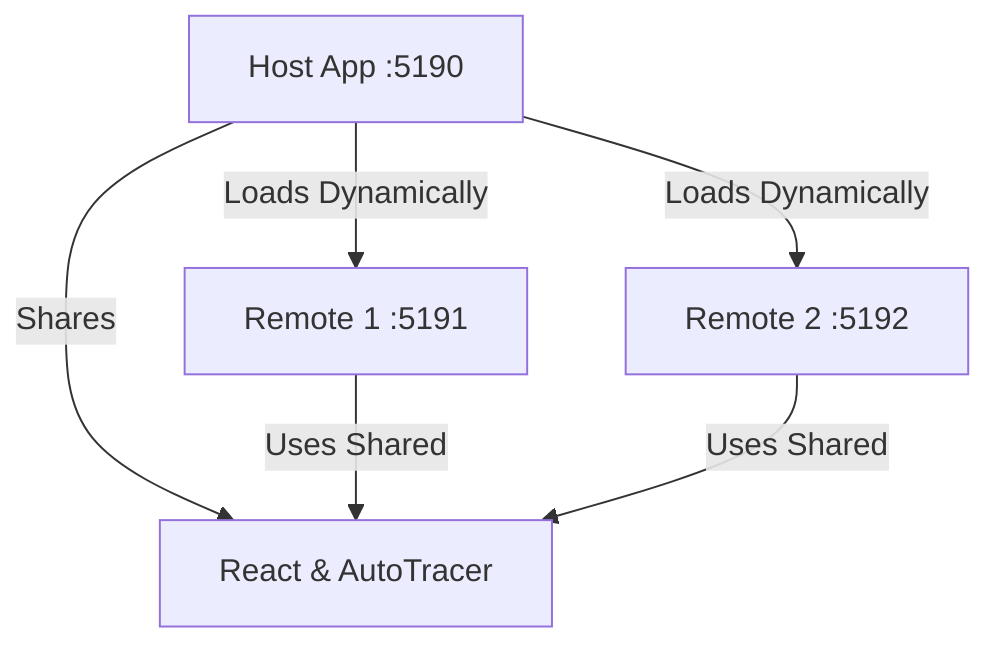

# Example Microfrontend Host

This is the **host application** in a microfrontend architecture demonstration. It dynamically loads two remote microfrontends (`remote1` and `remote2`) using Vite Module Federation and demonstrates AutoTracer behavior across microfrontend boundaries.

## Architecture



## Purpose

- **Host Application**: Coordinates and loads remote microfrontends
- **Module Federation**: Uses `@originjs/vite-plugin-federation` to load remotes at runtime
- **AutoTracer Integration**: Demonstrates tracing across microfrontend boundaries
- **Dynamic Loading**: Uses React Suspense and lazy loading for remote components

## Structure

```
example-microfrontend-host/
├── src/
│   ├── App.tsx          # Main host component with remote loading
│   ├── App.css          # Styling for host layout
│   ├── main.tsx         # Entry point with AutoTracer initialization
│   └── index.css        # Global styles
├── package.json         # Dependencies including Module Federation plugin
├── vite.config.ts       # Vite config with federation setup
└── README.md            # This file
```

## Configuration

### Module Federation Setup

The host is configured to load two remotes:

- **remote1**: http://localhost:5191/assets/remoteEntry.js
- **remote2**: http://localhost:5192/assets/remoteEntry.js

Shared modules: `react`, `react-dom`

**Note**: AutoTracer is **not** currently shared via Module Federation. Each application bundles its own AutoTracer instance. This allows investigation of how multiple AutoTracer instances behave in a microfrontend architecture.

### Ports

- **Host**: 5190
- **Remote 1**: 5191
- **Remote 2**: 5192

## Usage

### Development

All three applications must be running simultaneously:

```bash
# Terminal 1 - Host
pnpm --filter example-microfrontend-host dev

# Terminal 2 - Remote 1
pnpm --filter example-microfrontend-remote1 dev

# Terminal 3 - Remote 2
pnpm --filter example-microfrontend-remote2 dev
```

Then open http://localhost:5190

### Build

```bash
pnpm --filter example-microfrontend-host build
```

## Features

### Host Controls

- **Host Counter**: Local state to demonstrate host-level tracing
- **Hide/Show Remote 1**: Dynamically mount/unmount the first remote
- **Hide/Show Remote 2**: Dynamically mount/unmount the second remote

### AutoTracer Integration

The host initializes AutoTracer **before** React renders:

```typescript
autoTracer({
  enabled: true,
  includeReconciled: "always" as const,
  showFlags: false,
  includeSkipped: "always" as const,
  enableAutoTracerInternalsLogging: true,
  maxFiberDepth: 2,
  includeNonTrackedBranches: true,
});
```

Each remote application also initializes its own AutoTracer instance (for standalone mode), creating multiple independent tracing streams in the microfrontend setup.

## Code Examples

### Loading Remote Components

```typescript
// Dynamic import with Module Federation
const Remote1App = lazy(() => import("remote1/App"));
const Remote2App = lazy(() => import("remote2/App"));

// Usage with Suspense
<Suspense fallback={<div>Loading Remote 1...</div>}>
  <Remote1App />
</Suspense>
```

### AutoTracer Hook

```typescript
function App() {
  useAutoTracer(); // Trace host component renders
  // ... component logic
}
```

## Dependencies

- **react**: ^18.3.1
- **react-dom**: ^18.3.1
- **@auto-tracer/react18**: workspace package
- **@originjs/vite-plugin-federation**: ^1.3.5
- **vite**: ^5.3.1

## Microfrontend Testing

This app is part of a three-app setup to investigate AutoTracer behavior in microfrontend scenarios:

1. **Independent AutoTracer Instances**: Each app has its own AutoTracer instance
2. **Cross-Boundary Tracing**: Verify independent tracing works across microfrontend boundaries
3. **Dynamic Loading**: Test tracing during remote mount/unmount
4. **State Isolation**: Ensure each microfrontend's state is tracked independently

See [MICROFRONTEND-README.md](../MICROFRONTEND-README.md) for the complete investigation guide.

## Related Apps

- [`example-microfrontend-remote1`](../example-microfrontend-remote1/README.md)
- [`example-microfrontend-remote2`](../example-microfrontend-remote2/README.md)
