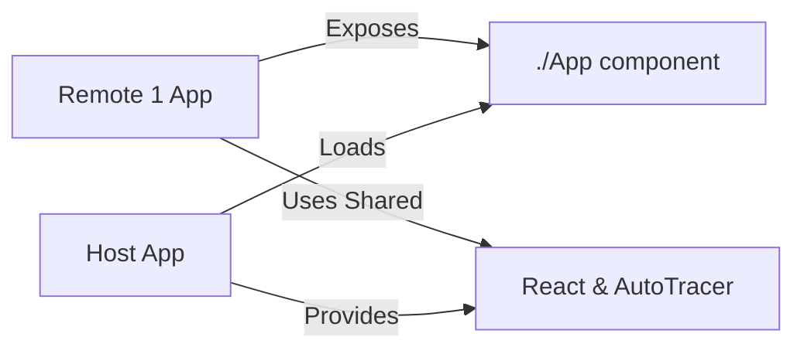

# Example Microfrontend Remote 1

This is **Remote 1** in a microfrontend architecture demonstration. It can run standalone or be dynamically loaded by the host application using Vite Module Federation.

## Architecture



## Purpose

- **Remote Microfrontend**: Independently deployable React application
- **Dual Mode**: Can run standalone (dev) or as remote (loaded by host)
- **AutoTracer Integration**: Demonstrates component-level tracing with labeled state
- **Module Federation**: Exposes `./App` component for dynamic import

## Structure

```
example-microfrontend-remote1/
├── src/
│   ├── App.tsx          # Main remote component with Counter and TodoList
│   ├── App.css          # Styling for remote components
│   ├── main.tsx         # Entry point with conditional AutoTracer init
│   └── index.css        # Global styles
├── package.json         # Dependencies including Module Federation plugin
├── vite.config.ts       # Vite config exposing App component
└── README.md            # This file
```

## Configuration

### Module Federation Setup

Exposes:
- **./App**: Main application component (`./src/App.tsx`)

Shared modules: `react`, `react-dom`

**Note**: AutoTracer is **not** shared via Module Federation. Each app has its own AutoTracer instance.

### Port

- **Remote 1**: 5191

## Usage

### Standalone Development

Run independently for development and testing:

```bash
pnpm --filter example-microfrontend-remote1 dev
```

Then open http://localhost:5191

### As Remote (Loaded by Host)

The host application loads this remote dynamically:

```bash
# Start this remote
pnpm --filter example-microfrontend-remote1 dev

# Start the host (in another terminal)
pnpm --filter example-microfrontend-host dev
```

Then open http://localhost:5190 to see the host loading this remote.

### Build

```bash
pnpm --filter example-microfrontend-remote1 build
```

## Features

### Components

#### Counter Component
- Simple counter with increment button
- Demonstrates `useAutoTracer` and `labelState`
- Tracked state: `count`

#### TodoList Component
- Add/display todo items
- Input field with Enter key support
- Tracked states: `todos`, `input`

#### App Component (Exported)
- Toggle visibility of Counter and TodoList
- Tracked states: `showCounter`, `showTodos`
- Coordinates child components

### AutoTracer Integration

#### Standalone Mode
When running independently, initializes its own AutoTracer:

```typescript
if (!window.__AUTOTRACER_INITIALIZED__) {
  autoTracer({
    enabled: true,
    includeReconciled: "always" as const,
    showFlags: false,
    includeSkipped: "always" as const,
    enableAutoTracerInternalsLogging: true,
    maxFiberDepth: 2,
    includeNonTrackedBranches: true,
  });
  (window as any).__AUTOTRACER_INITIALIZED__ = true;
}
```

#### Remote Mode
When loaded by host, still initializes its own AutoTracer instance (not shared via Module Federation).

#### Labeled State

All state is labeled for clear tracing:

```typescript
const logger = useAutoTracer();
const [count, setCount] = useState(0);
logger.labelState(0, "count", count, "setCount", setCount);

const [todos, setTodos] = useState<string[]>([]);
logger.labelState(0, "todos", todos, "setTodos", setTodos);
```

## Code Examples

### Component with AutoTracer

```typescript
function Counter() {
  const logger = useAutoTracer(); // Enable tracing for this component

  const [count, setCount] = useState(0);
  logger.labelState(0, "count", count, "setCount", setCount);

  return (
    <button onClick={() => setCount(c => c + 1)}>
      Count: {count}
    </button>
  );
}
```

### Exposing Component via Module Federation

```typescript
// vite.config.ts
federation({
  name: 'remote1',
  filename: 'remoteEntry.js',
  exposes: {
    './App': './src/App.tsx',
  },
  shared: ['react', 'react-dom', '@auto-tracer/react18']
})
```

## Dependencies

- **react**: ^18.3.1
- **react-dom**: ^18.3.1
- **@auto-tracer/react18**: workspace package
- **@originjs/vite-plugin-federation**: ^1.3.5
- **vite**: ^5.3.1

## Microfrontend Testing

This remote is part of a three-app setup to investigate AutoTracer behavior:

1. **Independent AutoTracer**: Has its own AutoTracer instance (not shared)
2. **State Isolation**: Each component's state is independently tracked
3. **Component Lifecycle**: Tracing works during mount/unmount
4. **Labeled State**: All state changes include meaningful labels

See [MICROFRONTEND-README.md](../MICROFRONTEND-README.md) for the complete investigation guide.

## Related Apps

- [`example-microfrontend-host`](../example-microfrontend-host/README.md)
- [`example-microfrontend-remote2`](../example-microfrontend-remote2/README.md)
