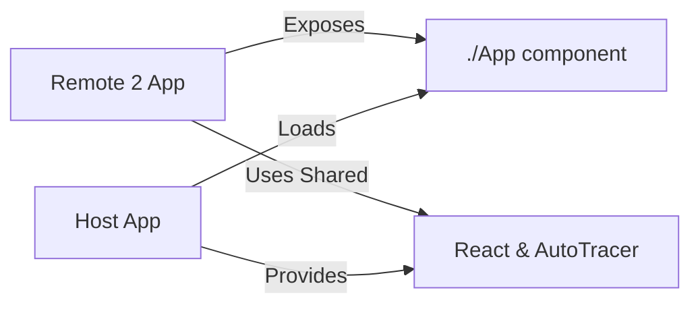

# Example Microfrontend Remote 2

This is **Remote 2** in a microfrontend architecture demonstration. It can run standalone or be dynamically loaded by the host application using Vite Module Federation.

## Architecture



## Purpose

- **Remote Microfrontend**: Independently deployable React application
- **Dual Mode**: Can run standalone (dev) or as remote (loaded by host)
- **AutoTracer Integration**: Demonstrates component-level tracing with labeled state and effects
- **Module Federation**: Exposes `./App` component for dynamic import

## Structure

```
example-microfrontend-remote2/
├── src/
│   ├── App.tsx          # Main remote component with Timer and Form
│   ├── App.css          # Styling for remote components
│   ├── main.tsx         # Entry point with conditional AutoTracer init
│   └── index.css        # Global styles
├── package.json         # Dependencies including Module Federation plugin
├── vite.config.ts       # Vite config exposing App component
└── README.md            # This file
```

## Configuration

### Module Federation Setup

Exposes:
- **./App**: Main application component (`./src/App.tsx`)

Shared modules: `react`, `react-dom`

**Note**: AutoTracer is **not** shared via Module Federation. Each app has its own AutoTracer instance.

### Port

- **Remote 2**: 5192

## Usage

### Standalone Development

Run independently for development and testing:

```bash
pnpm --filter example-microfrontend-remote2 dev
```

Then open http://localhost:5192

### As Remote (Loaded by Host)

The host application loads this remote dynamically:

```bash
# Start this remote
pnpm --filter example-microfrontend-remote2 dev

# Start the host (in another terminal)
pnpm --filter example-microfrontend-host dev
```

Then open http://localhost:5190 to see the host loading this remote.

### Build

```bash
pnpm --filter example-microfrontend-remote2 build
```

## Features

### Components

#### Timer Component
- Start/pause/reset timer
- Updates every second using `useEffect`
- Tracked states: `seconds`, `isRunning`
- Demonstrates effect-based state updates

#### Form Component
- Name and email input fields
- Form submission with success message
- Tracked states: `name`, `email`, `submitted`
- Auto-hide success message after 2 seconds

#### App Component (Exported)
- Toggle visibility of Timer and Form
- Tracked states: `showTimer`, `showForm`
- Coordinates child components

### AutoTracer Integration

#### Standalone Mode
When running independently, initializes its own AutoTracer:

```typescript
if (!window.__AUTOTRACER_INITIALIZED__) {
  autoTracer({
    enabled: true,
    includeReconciled: "always" as const,
    showFlags: false,
    includeSkipped: "always" as const,
    enableAutoTracerInternalsLogging: true,
    maxFiberDepth: 2,
    includeNonTrackedBranches: true,
  });
  (window as any).__AUTOTRACER_INITIALIZED__ = true;
}
```

#### Remote Mode
When loaded by host, still initializes its own AutoTracer instance (not shared via Module Federation).

#### Labeled State

All state is labeled for clear tracing:

```typescript
const logger = useAutoTracer();
const [seconds, setSeconds] = useState(0);
logger.labelState(0, "seconds", seconds, "setSeconds", setSeconds);

const [name, setName] = useState("");
logger.labelState(0, "name", name, "setName", setName);
```

#### Effect Tracing

The Timer component demonstrates tracing with effects:

```typescript
useEffect(() => {
  if (!isRunning) return;

  const interval = setInterval(() => {
    setSeconds(s => s + 1);
  }, 1000);

  return () => clearInterval(interval);
}, [isRunning, setSeconds]);
```

## Code Examples

### Component with Effects

```typescript
function Timer() {
  const logger = useAutoTracer(); // Enable tracing

  const [seconds, setSeconds] = useState(0);
  logger.labelState(0, "seconds", seconds, "setSeconds", setSeconds);

  const [isRunning, setIsRunning] = useState(false);
  logger.labelState(1, "isRunning", isRunning, "setIsRunning", setIsRunning);

  // Effect is traced automatically
  useEffect(() => {
    if (!isRunning) return;
    const interval = setInterval(() => setSeconds(s => s + 1), 1000);
    return () => clearInterval(interval);
  }, [isRunning, setSeconds]);

  return (/* ... */);
}
```

### Form Handling with AutoTracer

```typescript
function Form() {
  const logger = useAutoTracer();

  const [name, setName] = useState("");
  logger.labelState(0, "name", name, "setName", setName);

  const [submitted, setSubmitted] = useState(false);
  logger.labelState(1, "submitted", submitted, "setSubmitted", setSubmitted);

  const handleSubmit = (e: React.FormEvent) => {
    e.preventDefault();
    setSubmitted(true);
    setTimeout(() => setSubmitted(false), 2000);
  };

  return (/* form JSX */);
}
```

## Dependencies

- **react**: ^18.3.1
- **react-dom**: ^18.3.1
- **@auto-tracer/react18**: workspace package
- **@originjs/vite-plugin-federation**: ^1.3.5
- **vite**: ^5.3.1

## Microfrontend Testing

This remote is part of a three-app setup to investigate AutoTracer behavior:

1. **Independent AutoTracer**: Has its own AutoTracer instance (not shared)
2. **Effect Tracing**: Timer demonstrates tracing with `useEffect`
3. **Form State**: Multiple state variables tracked independently
4. **Async Updates**: Success message with timeout demonstrates async state changes

See [MICROFRONTEND-README.md](../MICROFRONTEND-README.md) for the complete investigation guide.

## Related Apps

- [`example-microfrontend-host`](../example-microfrontend-host/README.md)
- [`example-microfrontend-remote1`](../example-microfrontend-remote1/README.md)
