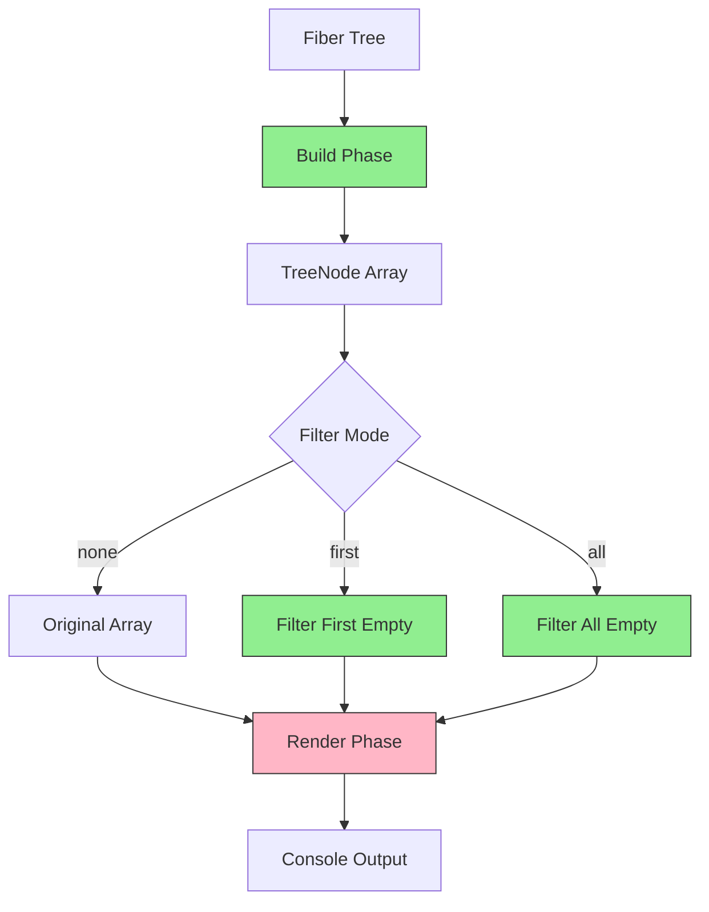

# Filter Empty Nodes Feature Specification

## Specification Changelog

### Version 1.3 (Current)

- **Fixed code examples**: Added missing `options` parameter to all filter function calls
- **Clarified marker formatting**: Markers show count format OR level format (not both simultaneously)
- **Added interaction matrix**: Table showing how options combine
- **Added complexity analysis**: Big-O notation for each pipeline phase
- **Clarified visibility precedence**: Visibility filtering always dominates content richness
- **Removed impossible scenario**: Reconciled nodes cannot have state changes by React semantics

### Version 1.2

- **Corrected "empty node" definition**: Empty nodes are those that won't produce output with current settings. This includes BOTH nodes filtered by visibility settings (`includeReconciled`, `includeSkipped`) AND nodes with no meaningful content (no state/prop/log changes, not a mount, not tracked)
- **Made `isEmptyNode` settings-aware**: Now accepts options parameter to check visibility filtering
- **Clarified two-phase filtering**: Visibility filtering (by renderType) THEN content filtering (by changes) - both contribute to emptiness

### Version 1.1

- **Refined "empty node" definition**: Empty nodes are content-based - no state/prop/log changes, not a mount, not tracked. ~~This is orthogonal to visibility filtering~~ (corrected in v1.2)
- **Clarified tracking semantics**: "Tracked" means component uses `useAutoTracer()` hook and has a trackingGUID
- **Clarified mount semantics**: Mount status encoded in `renderType === "Mount"`, removed redundant `isMount` boolean from TreeNode
- **Added depth preservation invariant**: Depth always refers to original fiber depth, never renumbered
- **Added indentation vs depth explanation**: Visual indentation shows filtered structure, depth labels show original position
- **Added processing order**: `maxFiberDepth` → build tree → filter → render
- **Added determinism guarantees**: No reordering, depth preservation, idempotency
- **Removed alternative approach**: Only functional composition approach (Approach 2 removed per project standards)
- **Moved `isEmptyNode`**: From `building/` to `filtering/` directory (it's a filtering predicate)
- **Emphasized fallback behavior**: Invalid `filterEmptyNodes` values default to "none"

### Version 1.0 (Initial Draft)

- Initial feature specification with two architectural approaches
- Basic empty node definition
- Filter modes: none, first, all
- Depth indicator support

## Overview

In applications with deep provider hierarchies (especially Next.js apps with Redux, MUI ThemeProvider, etc.), the auto-tracer output becomes overwhelming with empty/reconciled nodes that wrap the entire screen estate. This feature adds intelligent filtering to make the output more compact and readable while preserving important information.

## Glossary

- **Fiber**: React's internal representation of a component instance in the virtual DOM tree
- **TreeNode**: Immutable data structure extracted from a fiber, containing all information needed for rendering
- **Empty Node**: A node that won't produce output with current settings - either filtered by visibility (Reconciled when `includeReconciled=false`, Skipped when `includeSkipped=false`) OR has no meaningful content (no state/prop/log changes, not a mount, not tracked)
- **Marker Node**: A special node type that represents collapsed empty nodes in the output
- **Visibility Filtering**: Settings that control which node types are shown (`includeReconciled`, `includeSkipped`). Takes precedence over content richness—if a node is visibility-filtered, it's treated as empty regardless of changes or warnings
- **Content Filtering**: Checking if a node has meaningful changes (state, props, logs)
- **Depth**: The zero-based nesting level of a node in the original fiber tree
- **Visual Indent**: The indentation level in the rendered output (may differ from depth after filtering)
- **Depth Label**: The `(Level: N)` annotation shown when `enableAutoTracerInternalsLogging` is enabled
- **Tracked Component**: A component that uses the `useAutoTracer()` hook and has a trackingGUID

## Architecture Overview



**Legend:**

- 🟢 Green boxes: Pure functions (no side effects)
- 🔴 Pink boxes: Impure functions (I/O operations)

## Problem Statement

### Current Behavior

When tracing a Next.js app with multiple provider levels:

```
└─┐
  └─┐
    └─┐
      └─┐
        └─┐
          └─┐
            └─┐
              └─┐
                └─┐
                  └─┐
                    └─┐
                      └─┐
                        └─┐
                          └─┐
                            └─┐
                              ├─ [TodoList] Rendering ⚡
                              │   State change todos: [...] → [...]
```

Many of these intermediate levels are provider components that don't have meaningful state or prop changes. They just add visual noise and consume screen estate.

### Desired Behavior

With filtering enabled, the same output becomes:

```
└─┐
  ├─ [TodoList] Rendering ⚡
  │   State change todos: [...] → [...]
```

## Feature Requirements

### 1. New Option: `filterEmptyNodes`

Add a new configuration option to `AutoTracerOptions`:

```typescript
interface AutoTracerOptions {
  // ... existing options

  /**
   * Filter empty nodes from the output to reduce visual clutter.
   * - "none": Show all nodes (current behavior)
   * - "first": Collapse all initial empty nodes into a single marker
   * - "all": Collapse all empty nodes (initial and intermediate) into markers
   *
   * An "empty node" is defined as a component that won't produce output with
   * current settings. A node is considered empty if ANY of the following are true:
   *
   * 1. VISIBILITY FILTERED:
   *    - renderType === "Reconciled" AND includeReconciled === false
   *    - renderType === "Skipped" AND includeSkipped === false
   *
   * 2. CONTENT EMPTY (all must be true):
   *    - No state changes (stateChanges.length === 0)
   *    - No prop changes (propChanges.length === 0)
   *    - No component logs (componentLogs.length === 0)
   *    - Not a mount (renderType !== "Mount")
   *    - Not a marker (renderType !== "Marker")
   *    - Not tracked (not using useAutoTracer() hook)
   *    - No identical value warnings (hasIdenticalValueWarning === false)
   *
   * This means if you set includeReconciled=false, ALL Reconciled nodes will be
   * collapsed as "empty" regardless of whether they have state/prop changes,
   * because you've indicated you don't want to see them.
   *
   * Invalid values fallback to "none" (show all nodes).
   *
   * Default: "none"
   */
  filterEmptyNodes?: "none" | "first" | "all";
}
```

### 2. Filter Modes Explained

#### Mode: "none" (Default)

- Current behavior - show all nodes regardless of content
- Maximum visibility, maximum verbosity
- Useful for deep debugging

#### Mode: "first"

- Collapse all consecutive empty nodes at the START of the tree
- Show a single marker indicating how many levels were skipped
- Once a non-empty node is found, show all subsequent nodes normally
- Useful for apps with deep provider hierarchies that don't change

**Example:**

```
Before (15 empty provider levels, then content):
└─┐
  └─┐
    └─┐
    ... (12 more)
      ├─ [TodoList] Rendering

After:
└─┐
  ├─ [TodoList] Rendering
```

#### Mode: "all"

- Collapse ALL consecutive empty nodes throughout the tree
- Replace each sequence of empty nodes with a marker
- Most compact output
- Useful for production-like scenarios with many providers

**Example:**

```
Before:
└─┐
  └─┐
    ├─ [TodoList] Rendering
    │   State change todos: [...]
    └─┐
      └─┐
        └─┐
          ├─ [TodoItem] Rendering

After:
└─┐
  ├─ [TodoList] Rendering
  │   State change todos: [...]
  └─┐
    ├─ [TodoItem] Rendering
```

### 3. Level Depth Indicator

When `enableAutoTracerInternalsLogging` is enabled, show the actual fiber depth/level on connector lines:

```typescript
// Current
log(`${connectIndent}└─┐`);

// New (when enableAutoTracerInternalsLogging === true)
log(`${connectIndent}└─┐ (Level: ${depth})`);
```

**Example output (filter: "none"):**

```
└─┐ (Level: 0)
  └─┐ (Level: 1)
    └─┐ (Level: 2)
      ├─ [TodoList] Rendering ⚡
```

**Example output (filter: "first" | "all"):**

```
└─┐ (Level: 2)
  ├─ [TodoList] Rendering ⚡
```

**Note on marker rendering:**

Markers use **one of two mutually exclusive formats** depending on the `enableAutoTracerInternalsLogging` setting:

- When `enableAutoTracerInternalsLogging` is **false** (default): `└─┐ ... (5 empty levels)` — shows **count** of collapsed nodes
- When `enableAutoTracerInternalsLogging` is **true**: `└─┐ ... (Level: 5)` — shows **depth level** of the marker

These formats are never mixed in the same output. The choice affects all markers uniformly.

This may be adjusted during QA based on readability feedback.

This helps developers understand the actual nesting depth and diagnose depth-related issues.

## Architectural Approaches

The current implementation in `walkFiberForUpdates.ts` tightly couples:

1. Fiber tree traversal
2. Filtering logic (tracked/untracked, reconciled/skipped)
3. Output rendering (console.log with formatting)

To implement this feature cleanly, we should refactor using **functional programming principles**:

- **Pure functions**: No side effects, deterministic output
- **Total functions**: All inputs produce valid outputs (no exceptions)
- **One function per file**: Maximum clarity and testability
- **Low cyclomatic complexity**: Minimal branching, prefer composition
- **Immutable data**: No mutation of input data

### Approach 1: **Functional Composition Pattern** (Recommended)

**Concept**: Separate traversal, filtering, and rendering into pure, composable functions. Each function is total, pure, and lives in its own file.

#### File Structure

```
packages/auto-tracer-react18/src/lib/functions/treeProcessing/
├── types/
│   ├── TreeNode.ts                      // Type definitions only
│   ├── StateChange.ts
│   ├── PropChange.ts
│   └── ComponentLog.ts
├── building/
│   ├── buildTreeNode.ts                 // Pure: fiber → TreeNode
│   ├── buildTreeFromFiber.ts            // Pure: (fiber, depth) → TreeNode[]
│   └── extractNodeInfo.ts               // Pure: fiber → NodeInfo
├── filtering/
│   ├── isEmptyNode.ts                   // Pure: TreeNode → boolean
│   ├── filterFirstEmptyNodes.ts         // Pure: TreeNode[] → TreeNode[]
│   ├── filterAllEmptyNodes.ts           // Pure: TreeNode[] → TreeNode[]
│   ├── applyEmptyNodeFilter.ts          // Pure: (TreeNode[], mode) → TreeNode[]
│   └── createMarkerNode.ts              // Pure: (depth, count) → TreeNode
├── rendering/
│   ├── formatConnector.ts               // Pure: (depth, showLevel) → string
│   ├── formatNodePrefix.ts              // Pure: (depth, nodeType) → string
│   ├── renderTreeNode.ts                // Impure (logs): (TreeNode, lastDepth) → number
│   └── renderTree.ts                    // Impure (logs): TreeNode[] → void
└── index.ts                             // Exports all functions
```

#### Type Definitions

**File: `types/TreeNode.ts`**

```typescript
/**
 * Immutable representation of a fiber node with all extracted information
 */
export interface TreeNode {
  readonly depth: number;
  readonly componentName: string;
  readonly displayName: string;
  readonly renderType: RenderType;
  readonly flags: number;
  readonly stateChanges: readonly StateChange[];
  readonly propChanges: readonly PropChange[];
  readonly componentLogs: readonly ComponentLog[];
  readonly isTracked: boolean;
  readonly trackingGUID: string | null;
  readonly hasIdenticalValueWarning: boolean;
}

export type RenderType =
  | "Mount"
  | "Rendering"
  | "Reconciled"
  | "Skipped"
  | "Marker";
```

**Note**: The `isMount` boolean is not needed because mount status is encoded in `renderType`. A node is a mount if and only if `renderType === "Mount"`.

#### Building Phase - Pure Functions

**File: `building/buildTreeNode.ts`**

```typescript
import type { TreeNode } from "../types/TreeNode.js";

/**
 * Builds a TreeNode from a fiber node.
 *
 * Pure function - extracts data without modifying the fiber.
 * Total function - handles all fiber inputs safely.
 *
 * @param fiber - The React fiber node
 * @param depth - Current depth in the tree
 * @returns Immutable TreeNode representation
 */
export function buildTreeNode(fiber: unknown, depth: number): TreeNode {
  // Extract all information from fiber
  // Return immutable TreeNode
  // No side effects, no exceptions
}
```

**File: `building/buildTreeFromFiber.ts`**

```typescript
import type { TreeNode } from "../types/TreeNode.js";
import { buildTreeNode } from "./buildTreeNode.js";

/**
 * Recursively builds an array of TreeNodes from a fiber tree.
 *
 * Pure function - builds new data without modifying input.
 * Total function - handles all fiber structures safely.
 *
 * @param fiber - Root fiber node
 * @param depth - Starting depth (typically 0)
 * @returns Array of TreeNodes in depth-first order
 */
export function buildTreeFromFiber(
  fiber: unknown,
  depth: number
): readonly TreeNode[] {
  if (!fiber || typeof fiber !== "object") {
    return [];
  }

  const fiberNode = fiber as {
    elementType?: unknown;
    child?: unknown;
    sibling?: unknown;
  };

  if (!fiberNode.elementType) {
    // Not a component, continue traversal
    return [
      ...buildTreeFromFiber(fiberNode.child, depth + 1),
      ...buildTreeFromFiber(fiberNode.sibling, depth),
    ];
  }

  const node = buildTreeNode(fiber, depth);

  return [
    node,
    ...buildTreeFromFiber(fiberNode.child, depth + 1),
    ...buildTreeFromFiber(fiberNode.sibling, depth),
  ];
}
```

#### Filtering Phase - Pure Functions

**File: `filtering/isEmptyNode.ts`**

```typescript
import type { TreeNode } from "../types/TreeNode.js";

/**
 * Determines if a tree node is "empty" (won't produce output with current settings).
 *
 * A node is empty if it meets ANY of these criteria:
 *
 * 1. VISIBILITY FILTERED:
 *    - Reconciled node when includeReconciled is false
 *    - Skipped node when includeSkipped is false
 *
 * 2. CONTENT EMPTY (all must be true):
 *    - No state changes, prop changes, or component logs
 *    - Not a mount (renderType !== "Mount")
 *    - Not a marker node (renderType !== "Marker")
 *    - Not a tracked component
 *    - No identical value change warnings
 *
 * Rationale: If a user sets includeReconciled=false, they're saying "I don't
 * want to see ANY Reconciled nodes." Even if such a node has state changes,
 * it won't be displayed and should be collapsed as "empty" for compaction.
 *
 * Note: Markers must be excluded to preserve idempotency guarantees.
 * Re-filtering an already filtered tree should produce identical results.
 *
 * Pure function - no side effects, deterministic output.
 * Total function - defined for all TreeNode inputs.
 *
 * @param node - The tree node to check
 * @param options - Settings that affect visibility
 * @returns true if node won't produce output
 */
export function isEmptyNode(
  node: TreeNode,
  options: { includeReconciled: boolean; includeSkipped: boolean }
): boolean {
  // Phase 1: Visibility filtering
  if (node.renderType === "Reconciled" && !options.includeReconciled) {
    return true;
  }
  if (node.renderType === "Skipped" && !options.includeSkipped) {
    return true;
  }

  // Phase 2: Content filtering
  return (
    node.stateChanges.length === 0 &&
    node.propChanges.length === 0 &&
    node.componentLogs.length === 0 &&
    node.renderType !== "Mount" &&
    node.renderType !== "Marker" &&
    !node.isTracked &&
    !node.hasIdenticalValueWarning
  );
}
```

**File: `filtering/createMarkerNode.ts`**

```typescript
import type { TreeNode } from "../types/TreeNode.js";

/**
 * Creates a marker node representing collapsed empty levels.
 *
 * Pure function - creates new immutable object.
 * Total function - defined for all valid inputs.
 *
 * @param depth - Depth at which marker should appear
 * @param count - Number of empty levels collapsed
 * @returns Marker TreeNode
 */
export function createMarkerNode(depth: number, count: number): TreeNode {
  const plural = count !== 1 ? "s" : "";

  return {
    depth,
    componentName: `... (${count} empty level${plural})`,
    displayName: `... (${count} empty level${plural})`,
    renderType: "Marker",
    flags: 0,
    stateChanges: [],
    propChanges: [],
    componentLogs: [],
    isTracked: false,
    trackingGUID: null,
    hasIdenticalValueWarning: false,
  };
}
```

**File: `filtering/filterFirstEmptyNodes.ts`**

```typescript
import type { TreeNode } from "../types/TreeNode.js";
import { isEmptyNode } from "./isEmptyNode.js";
import { createMarkerNode } from "./createMarkerNode.js";

/**
 * Filters only the initial sequence of empty nodes.
 *
 * Pure function - returns new array without modifying input.
 * Total function - handles all possible node arrays.
 *
 * @param nodes - Array of tree nodes
 * @param options - Settings that affect visibility
 * @returns New array with initial empty nodes collapsed into a marker
 */
export function filterFirstEmptyNodes(
  nodes: readonly TreeNode[],
  options: { includeReconciled: boolean; includeSkipped: boolean }
): readonly TreeNode[] {
  if (nodes.length === 0) {
    return nodes;
  }

  // Find first non-empty node using functional approach
  const firstNonEmptyIndex = nodes.findIndex(
    (node) => !isEmptyNode(node, options)
  );

  // If all nodes are empty or no empty nodes at start
  if (firstNonEmptyIndex === -1) {
    // All empty - create single marker at depth of first node
    const marker = createMarkerNode(nodes[0].depth, nodes.length);
    return [marker];
  }

  if (firstNonEmptyIndex === 0) {
    // No empty nodes at start
    return nodes;
  }

  // Create marker for initial empty sequence at depth of first collapsed node
  const marker = createMarkerNode(nodes[0].depth, firstNonEmptyIndex);
  return [marker, ...nodes.slice(firstNonEmptyIndex)];
}
```

**File: `filtering/filterAllEmptyNodes.ts`**

```typescript
import type { TreeNode } from "../types/TreeNode.js";
import { isEmptyNode } from "./isEmptyNode.js";
import { createMarkerNode } from "./createMarkerNode.js";

/**
 * Groups consecutive empty nodes and replaces each sequence with a marker.
 *
 * Pure function - uses reduce for immutable transformation.
 * Total function - handles all possible node arrays.
 *
 * @param nodes - Array of tree nodes
 * @param options - Settings that affect visibility
 * @returns New array with all empty node sequences collapsed
 */
export function filterAllEmptyNodes(
  nodes: readonly TreeNode[],
  options: { includeReconciled: boolean; includeSkipped: boolean }
): readonly TreeNode[] {
  if (nodes.length === 0) {
    return nodes;
  }

  // Use reduce to build result functionally
  interface Accumulator {
    readonly result: readonly TreeNode[];
    readonly pendingEmpty: readonly TreeNode[];
  }

  const initial: Accumulator = {
    result: [],
    pendingEmpty: [],
  };

  const final = nodes.reduce<Accumulator>((acc, node) => {
    if (isEmptyNode(node, options)) {
      // Add to pending empty sequence
      return {
        ...acc,
        pendingEmpty: [...acc.pendingEmpty, node],
      };
    }

    // Non-empty node - flush pending and add current
    if (acc.pendingEmpty.length > 0) {
      const marker = createMarkerNode(
        acc.pendingEmpty[0].depth,
        acc.pendingEmpty.length
      );
      return {
        result: [...acc.result, marker, node],
        pendingEmpty: [],
      };
    }

    return {
      ...acc,
      result: [...acc.result, node],
    };
  }, initial);

  // Handle any trailing empty nodes
  if (final.pendingEmpty.length > 0) {
    const marker = createMarkerNode(
      final.pendingEmpty[0].depth,
      final.pendingEmpty.length
    );
    return [...final.result, marker];
  }

  return final.result;
}
```

**File: `filtering/applyEmptyNodeFilter.ts`**

```typescript
import type { TreeNode } from "../types/TreeNode.js";
import { filterFirstEmptyNodes } from "./filterFirstEmptyNodes.js";
import { filterAllEmptyNodes } from "./filterAllEmptyNodes.js";

export type FilterMode = "none" | "first" | "all";

/**
 * Applies the specified empty node filtering strategy.
 *
 * Pure function - delegates to pure filter functions.
 * Total function - handles all filter modes with default.
 *
 * @param nodes - Array of tree nodes
 * @param mode - Filtering mode to apply
 * @param options - Settings that affect visibility
 * @returns Filtered array of tree nodes
 */
export function applyEmptyNodeFilter(
  nodes: readonly TreeNode[],
  mode: FilterMode,
  options: { includeReconciled: boolean; includeSkipped: boolean }
): readonly TreeNode[] {
  // Pattern match on mode using object lookup (no branches)
  const filters: Record<
    FilterMode,
    (
      ns: readonly TreeNode[],
      opts: { includeReconciled: boolean; includeSkipped: boolean }
    ) => readonly TreeNode[]
  > = {
    none: (ns) => ns,
    first: filterFirstEmptyNodes,
    all: filterAllEmptyNodes,
  };

  const filterFn = filters[mode] ?? filters.none;
  return filterFn(nodes, options);
}
```

#### Rendering Phase - Impure Functions (Documented)

**File: `rendering/formatConnector.ts`**

```typescript
/**
 * Formats a connector line for depth transitions.
 *
 * Pure function - string transformation only.
 * Total function - handles all valid depth values.
 *
 * @param depth - Current depth level
 * @param showLevel - Whether to include level number
 * @returns Formatted connector string
 */
export function formatConnector(depth: number, showLevel: boolean): string {
  const indent = "  ".repeat(Math.max(depth - 1, 0));
  const levelText = showLevel ? ` (Level: ${depth})` : "";
  return `${indent}└─┐${levelText}`;
}
```

**File: `rendering/renderTree.ts`**

```typescript
import type { TreeNode } from "../types/TreeNode.js";
import { renderTreeNode } from "./renderTreeNode.js";

/**
 * Renders an array of tree nodes to the console.
 *
 * IMPURE FUNCTION - Performs I/O (console logging).
 * Total function - handles all node arrays safely.
 *
 * Side effects:
 * - Writes to console
 *
 * @param nodes - Array of tree nodes to render
 */
export function renderTree(nodes: readonly TreeNode[]): void {
  let lastDepth = -1;

  for (const node of nodes) {
    lastDepth = renderTreeNode(node, lastDepth);
  }
}
```

#### Usage - Functional Pipeline

```typescript
import { buildTreeFromFiber } from "./building/buildTreeFromFiber.js";
import { applyEmptyNodeFilter } from "./filtering/applyEmptyNodeFilter.js";
import { renderTree } from "./rendering/renderTree.js";
import { traceOptions } from "../types/globalState.js";

// Explicit composition (recommended for clarity):
const processTree = (fiber: unknown, mode: FilterMode) => {
  const nodes = buildTreeFromFiber(fiber, 0);
  const filtered = applyEmptyNodeFilter(nodes, mode, {
    includeReconciled: traceOptions.includeReconciled ?? false,
    includeSkipped: traceOptions.includeSkipped ?? false,
  });
  renderTree(filtered); // Only impure step, clearly isolated
};

// Usage
processTree(rootFiber, "first");
```

**Benefits:**

- **Testability**: Each pure function is trivial to test in isolation
- **Clarity**: One function per file, clear purpose
- **Composability**: Functions can be composed in different ways
- **Maintainability**: Low cyclomatic complexity, easy to understand
- **Predictability**: Pure functions are deterministic and safe
- **Type Safety**: Total functions with TypeScript strict mode
- **Side Effect Isolation**: Impure functions clearly marked and isolated

**Drawbacks:**

- More files (but each is simple and focused)
- Requires functional programming discipline
- Some performance overhead from immutability (usually negligible)

## Recommendation

The functional composition pattern is the only approach that aligns with the project's strict functional programming requirements. It provides:

- Pure, total functions with one function per file
- Low cyclomatic complexity
- Excellent testability and maintainability
- Clear separation of concerns (build → filter → render)
- Easy to reason about and extend

### Implementation Strategy

1. **Phase 1**: Implement core functional pipeline (Week 1-2)

   - Create type definitions
   - Implement pure building functions
   - Implement pure filtering functions
   - Implement rendering functions (clearly marked as impure)

2. **Phase 2**: Integrate and test (Week 2)

   - Replace existing code with functional pipeline
   - Comprehensive unit tests for each function
   - Integration tests for the full pipeline

3. **Phase 3**: Documentation and optimization (Week 3)
   - TSDoc comments for all functions
   - Performance profiling
   - README updates

## Implementation Plan

### Phase 1: Type Definitions and Core Functions (Week 1)

1. **Create type definitions**

   - File: `packages/auto-tracer-react18/src/lib/functions/treeProcessing/types/TreeNode.ts`
   - File: `packages/auto-tracer-react18/src/lib/functions/treeProcessing/types/StateChange.ts`
   - File: `packages/auto-tracer-react18/src/lib/functions/treeProcessing/types/PropChange.ts`
   - File: `packages/auto-tracer-react18/src/lib/functions/treeProcessing/types/ComponentLog.ts`
   - All types should be `readonly` interfaces for immutability

2. **Implement building functions (all pure)**

   - File: `building/buildTreeNode.ts` - Pure transformation
   - File: `building/buildTreeFromFiber.ts` - Pure recursive transformation
   - File: `building/extractNodeInfo.ts` - Pure extraction
   - Each function: TSDoc, pure, total, one per file

3. **Implement filtering functions (all pure)**

   - File: `filtering/isEmptyNode.ts` - Pure predicate function
   - File: `filtering/createMarkerNode.ts` - Pure factory function
   - File: `filtering/filterFirstEmptyNodes.ts` - Pure array transformation
   - File: `filtering/filterAllEmptyNodes.ts` - Pure array transformation using reduce
   - File: `filtering/applyEmptyNodeFilter.ts` - Pure dispatcher (no branching)

4. **Add configuration option**

   - File: `packages/auto-tracer-react18/src/lib/interfaces/AutoTracerOptions.ts`
   - Add `filterEmptyNodes?: "none" | "first" | "all"`

5. **Update defaults**
   - File: `packages/auto-tracer-react18/src/lib/types/defaultSettings.ts`
   - Set default: `filterEmptyNodes: "none"`

### Phase 2: Rendering and Integration (Week 2)

1. **Implement rendering functions (impure, documented)**

   - File: `rendering/formatConnector.ts` - Pure string formatting
   - File: `rendering/formatNodePrefix.ts` - Pure string formatting
   - File: `rendering/renderTreeNode.ts` - IMPURE (logs to console)
   - File: `rendering/renderTree.ts` - IMPURE (logs to console)
   - Clearly mark impure functions with TSDoc annotations

2. **Add depth indicators**

   - Integrate into `formatConnector.ts`
   - Use `enableAutoTracerInternalsLogging` option

3. **Integrate functional pipeline**

   - Update `walkFiberForUpdates.ts` or create new entry point
   - Replace imperative logic with functional pipeline
   - Maintain backward compatibility

4. **Update deep merge for new option**

   - File: `packages/auto-tracer-react18/src/lib/functions/deepMerge.ts`
   - Add `filterEmptyNodes` handling

5. **Update validation**
   - File: `packages/auto-tracer-react18/src/lib/functions/validateOptions.ts`
   - Validate `filterEmptyNodes` is one of the allowed values

### Phase 3: Testing (Week 2-3)

1. **Unit tests for each pure function**

   - File: `tests/lib/functions/treeProcessing/filtering/isEmptyNode.test.ts`
   - File: `tests/lib/functions/treeProcessing/building/buildTreeNode.test.ts`
   - File: `tests/lib/functions/treeProcessing/filtering/filterFirstEmptyNodes.test.ts`
   - File: `tests/lib/functions/treeProcessing/filtering/filterAllEmptyNodes.test.ts`
   - File: `tests/lib/functions/treeProcessing/filtering/applyEmptyNodeFilter.test.ts`
   - Each test should verify pure, total behavior

2. **Integration tests**

   - File: `tests/lib/functions/treeProcessing/integration.test.ts`
   - Test full pipeline with various fiber structures
   - Test all filter modes
   - Test edge cases

3. **Visual/E2E tests**
   - Add test to Next.js app with provider hierarchies
   - Verify output formatting
   - Verify depth indicators

### Phase 4: Documentation (Week 3)

1. **Update README**

   - File: `packages/auto-tracer-react18/README.md`
   - Document `filterEmptyNodes` option
   - Add examples with different modes
   - Explain when to use each mode

2. **Add architecture documentation**

   - Document functional pipeline architecture
   - Explain pure vs impure functions
   - Add flowchart/diagram

3. **Update package README**
   - Add examples of output with different settings

## Option Interaction Matrix

The following table shows how `filterEmptyNodes` interacts with visibility settings:

| includeReconciled | includeSkipped | filterEmptyNodes | Reconciled Nodes         | Skipped Nodes            | Notes                          |
| ----------------- | -------------- | ---------------- | ------------------------ | ------------------------ | ------------------------------ |
| true              | true           | "none"           | Shown if have content    | Shown if have content    | Maximum visibility             |
| true              | true           | "first"          | Initial empty collapsed  | Initial empty collapsed  | Common for deep providers      |
| true              | true           | "all"            | All empty collapsed      | All empty collapsed      | Maximum compaction             |
| **false**         | true           | "none"           | **All treated as empty** | Shown if have content    | Visibility wins over content   |
| **false**         | true           | "all"            | **All collapsed**        | Empty ones collapsed     | Reconciled always hidden       |
| true              | **false**      | "none"           | Shown if have content    | **All treated as empty** | Visibility wins over content   |
| true              | **false**      | "all"            | Empty ones collapsed     | **All collapsed**        | Skipped always hidden          |
| false             | false          | any              | **All collapsed**        | **All collapsed**        | Both types visibility-filtered |

**Key principle:** Visibility filtering takes absolute precedence. If `includeReconciled=false`, ALL Reconciled nodes are treated as empty and subject to collapsing, even if they theoretically had changes. If `includeSkipped=false`, ALL Skipped nodes are treated as empty.

**Note on identical value warnings:** If a node has `hasIdenticalValueWarning=true` but is visibility-filtered (e.g., Reconciled when `includeReconciled=false`), the warning is not shown because the entire node is excluded from output. To see warnings on reconciled nodes, enable `includeReconciled=true`.

## Performance & Complexity

The tree processing pipeline has predictable algorithmic complexity:

### Time Complexity

- **Build Phase** (`buildTreeFromFiber`): **O(n)** where n = number of fibers visited

  - Bounded by `maxFiberDepth` setting
  - Single depth-first traversal
  - Each fiber visited exactly once

- **Filter Phase** (`applyEmptyNodeFilter`):

  - Mode "none": **O(1)** — no-op, returns original array
  - Mode "first": **O(n)** — single pass with `findIndex` + slice
  - Mode "all": **O(n)** — single reduce pass with accumulator

- **Render Phase** (`renderTree`): **O(m)** where m = filtered node count (m ≤ n)
  - Simple iteration over filtered array
  - Console I/O dominates (impure side effect)

### Space Complexity

- **Build Phase**: **O(n)** — creates immutable TreeNode for each fiber
- **Filter Phase**: **O(n)** worst case — new array with all nodes retained
  - Best case: **O(k)** where k = number of marker nodes + non-empty nodes
  - Markers collapse sequences, reducing memory footprint
- **Total Pipeline**: **O(n)** — linear in fiber count

### Performance Expectations

- **Baseline**: Current coupled implementation (no separate build phase)
- **Overhead target**: <10% additional time vs baseline
- **Measurement methodology**:
  - Controlled fiber depth (e.g., 50, 100, 500 levels)
  - Varying density of non-empty nodes (0%, 10%, 50%, 100%)
  - Measure time from fiber tree entry to final console output
  - Compare with/without filtering enabled
- **Memory**: Immutable data structures add ~2x memory vs imperative approach, but simplified GC

**Note:** The immutability overhead is typically negligible compared to React fiber tree size and console I/O latency.

## Core Invariants and Guarantees

### Depth Preservation Invariant

**CRITICAL**: Depth values in TreeNode always refer to the original fiber depth in the React component tree. Filtering operations never renumber or modify depth values.

**Convention**: Depth is **zero-based**. The root fiber has depth 0, its children have depth 1, etc.

This means:

- A node at depth 15 in the fiber tree will have `depth: 15` in TreeNode
- After filtering, it still has `depth: 15` even if displayed earlier in the output
- Depth labels (when `enableAutoTracerInternalsLogging` is true) always show original fiber depth as `(Level: N)` where N is the zero-based depth
- This aids debugging by maintaining traceability to the actual React fiber tree structure

### Indentation vs Depth

After filtering, visual indentation may not correspond 1:1 with depth labels:

- **Visual indentation**: Derived from original depth values (even after filtering), calculated as `depth * 2` spaces
- **Depth label**: Shows the original fiber depth before filtering as `(Level: N)`

**Important**: Visual indentation continues to use the original depth values. This means:

- Filtering removes nodes but doesn't renumber depths
- Visual gaps in indentation indicate where nodes were removed
- Depth labels confirm the original nesting level

Example:

```
└─┐ (Level: 0)  ← Original depth 0, indent 0
  └─┐ (Level: 1)  ← Original depth 1, indent 2 spaces
    └─┐ ... (Level: 14)  ← Marker at depth 14 (collapsed 13 nodes)
      ├─ [TodoList] Rendering ⚡  ← Original depth 15, indent 30 spaces
```

This approach:

- Preserves traceability to the actual fiber tree structure
- Shows where nodes were removed (indentation jumps)
- Maintains consistency between depth labels and visual positioning

### Processing Order and maxFiberDepth

The tree building and filtering pipeline has a defined order of operations:

1. **Tree Traversal**: Walk the fiber tree up to `maxFiberDepth` (if set)
2. **Tree Building**: Extract all node information into immutable TreeNode array
3. **Filtering**: Apply `filterEmptyNodes` mode to the built tree
4. **Rendering**: Output the filtered tree to console

This means `maxFiberDepth` limits the tree **before** filtering is applied. If you set `maxFiberDepth: 20` and 15 levels are empty, filtering with mode "first" will show the first non-empty node with its original depth label, even though visually it appears near the top.

### Determinism Guarantees

The filtering operations provide strong determinism guarantees:

**Node Ordering**:

- Filtering never reorders nodes
- Original depth-first traversal order is preserved
- Sibling order remains unchanged

**Depth Values**:

- Depth values are never renumbered
- Each TreeNode's depth field is immutable and reflects original fiber depth
- Filtering only removes or replaces nodes, never modifies their depth

**Marker Insertion**:

- Markers are inserted at the depth of the first collapsed empty node
- Marker depth reflects where the collapsed sequence began
- A marker collapsing nodes at depths 5, 6, 7 will have depth 5

**Idempotency**:

- Applying the same filter mode twice produces identical results: `filter(filter(nodes)) === filter(nodes)`
- This holds for all modes: "none", "first", "all"

**No Side Effects**:

- Pure functions never modify input arrays
- All transformations return new immutable structures
- No global state mutations during filtering

## Edge Cases to Handle

1. **All nodes are empty**

   - Should collapse entire tree to single marker
   - Marker appears at depth of first node in original tree

2. **No empty nodes**

   - Should render normally
   - No markers needed

3. **Empty nodes only at start**

   - "first" and "all" should behave the same

4. **Alternating empty/non-empty**

   - "all" mode creates multiple markers
   - Should be readable

5. **Siblings with different depths**

   - Depth tracking must be correct
   - Markers should not break tree structure

6. **Very deep nesting (>100 levels)**

   - Should still respect maxFiberDepth
   - Markers should indicate actual skipped count

7. **Tracked component in empty sequence**

   - Tracked components are never "empty"
   - Should break the sequence appropriately

8. **Node with identical value warning**

   - Should be considered non-empty even with no other changes
   - `hasIdenticalValueWarning` flag must be set during build phase
   - **Exception:** If node is visibility-filtered (e.g., Reconciled when `includeReconciled=false`), visibility precedence applies and node is treated as empty

9. **Visibility-filtered nodes when settings exclude them**

   - Reconciled nodes when `includeReconciled=false`: Always treated as empty
   - Skipped nodes when `includeSkipped=false`: Always treated as empty
   - Visibility filtering takes precedence over any content richness
   - **Note:** React semantics mean Reconciled/Skipped nodes shouldn't have actual state/prop changes in practice, but the spec handles the theoretical case via visibility precedence

## Testing Strategy

### Test Utilities

Helper functions for creating test nodes (must be pure, no mutation):

```typescript
/**
 * Creates an empty node for testing.
 * Pure function - returns new immutable object each time.
 */
function createEmptyNode(depth: number): TreeNode {
  return {
    depth,
    componentName: "EmptyComponent",
    displayName: "EmptyComponent",
    renderType: "Reconciled",
    flags: 0,
    stateChanges: [],
    propChanges: [],
    componentLogs: [],
    isTracked: false,
    trackingGUID: null,
    hasIdenticalValueWarning: false,
  };
}

/**
 * Creates a non-empty node for testing.
 * Pure function - returns new immutable object each time.
 * Note: Hook type would be imported from existing source (StateChange interface)
 */
function createNonEmptyNode(depth: number): TreeNode {
  return {
    depth,
    componentName: "ActiveComponent",
    displayName: "ActiveComponent",
    renderType: "Rendering",
    flags: 0,
    stateChanges: [
      {
        name: "count",
        value: 1,
        prevValue: 0,
        hook: {} as Hook, // Type imported from existing StateChange interface
        isIdenticalValueChange: false,
        label: "count",
      },
    ],
    propChanges: [],
    componentLogs: [],
    isTracked: false,
    trackingGUID: null,
    hasIdenticalValueWarning: false,
  };
}
```

### Unit Tests - Pure Functions

Each pure function gets its own test file with comprehensive test cases:

**File: `tests/lib/functions/treeProcessing/filtering/isEmptyNode.test.ts`**

```typescript
describe("isEmptyNode", () => {
  const defaultOptions = { includeReconciled: true, includeSkipped: true };

  it("should return true for node with no changes and not a mount", () => {
    const node: TreeNode = {
      depth: 0,
      componentName: "Test",
      displayName: "Test",
      renderType: "Reconciled",
      flags: 0,
      stateChanges: [],
      propChanges: [],
      componentLogs: [],
      isTracked: false,
      trackingGUID: null,
      hasIdenticalValueWarning: false,
    };
    expect(isEmptyNode(node, defaultOptions)).toBe(true);
  });

  it("should return true for Reconciled node when includeReconciled=false (visibility precedence)", () => {
    const node: TreeNode = {
      depth: 0,
      componentName: "Test",
      displayName: "Test",
      renderType: "Reconciled",
      flags: 0,
      stateChanges: [], // Reconciled nodes don't have changes in practice (React semantics)
      propChanges: [],
      componentLogs: [],
      isTracked: false,
      trackingGUID: null,
      hasIdenticalValueWarning: false,
    };
    // Visibility filtering takes precedence - all Reconciled nodes treated as empty
    expect(
      isEmptyNode(node, { includeReconciled: false, includeSkipped: true })
    ).toBe(true);
  });

  it("should return true for Skipped node when includeSkipped=false", () => {
    const node: TreeNode = {
      depth: 0,
      componentName: "Test",
      displayName: "Test",
      renderType: "Skipped",
      flags: 0,
      stateChanges: [],
      propChanges: [],
      componentLogs: [],
      isTracked: false,
      trackingGUID: null,
      hasIdenticalValueWarning: false,
    };
    expect(
      isEmptyNode(node, { includeReconciled: true, includeSkipped: false })
    ).toBe(true);
  });

  it("should return false for mount", () => {
    const node: TreeNode = {
      depth: 0,
      componentName: "Test",
      displayName: "Test",
      renderType: "Mount", // Mount renderType
      flags: 0,
      stateChanges: [],
      propChanges: [],
      componentLogs: [],
      isTracked: false,
      trackingGUID: null,
      hasIdenticalValueWarning: false,
    };
    expect(isEmptyNode(node, defaultOptions)).toBe(false);
  });

  it("should return false for tracked component", () => {
    const node: TreeNode = {
      depth: 0,
      componentName: "Test",
      displayName: "Test",
      renderType: "Reconciled",
      flags: 0,
      stateChanges: [],
      propChanges: [],
      componentLogs: [],
      isTracked: true, // Tracked component
      trackingGUID: "guid-123",
      hasIdenticalValueWarning: false,
    };
    expect(isEmptyNode(node, defaultOptions)).toBe(false);
  });

  it("should return false for marker node", () => {
    const node: TreeNode = {
      depth: 0,
      componentName: "... (5 empty levels)",
      displayName: "... (5 empty levels)",
      renderType: "Marker", // Marker must not be considered empty
      flags: 0,
      stateChanges: [],
      propChanges: [],
      componentLogs: [],
      isTracked: false,
      trackingGUID: null,
      hasIdenticalValueWarning: false,
    };
    expect(isEmptyNode(node, defaultOptions)).toBe(false);
  });

  it("should return false for node with identical value warning", () => {
    const node: TreeNode = {
      depth: 0,
      componentName: "Test",
      displayName: "Test",
      renderType: "Rendering",
      flags: 0,
      stateChanges: [],
      propChanges: [],
      componentLogs: [],
      isTracked: false,
      trackingGUID: null,
      hasIdenticalValueWarning: true, // Has warning
    };
    expect(isEmptyNode(node, defaultOptions)).toBe(false);
  });

  it("should return false for node with state changes", () => {
    const node: TreeNode = {
      depth: 0,
      componentName: "Test",
      displayName: "Test",
      renderType: "Rendering",
      flags: 0,
      stateChanges: [
        {
          name: "test",
          value: 1,
          prevValue: 0,
          hook: {} as Hook,
          isIdenticalValueChange: false,
          label: "test",
        },
      ],
      propChanges: [],
      componentLogs: [],
      isTracked: false,
      trackingGUID: null,
      hasIdenticalValueWarning: false,
    };
    expect(isEmptyNode(node, defaultOptions)).toBe(false);
  });

  // More test cases for prop changes, logs, etc.
});
```

**File: `tests/lib/functions/treeProcessing/filtering/filterFirstEmptyNodes.test.ts`**

```typescript
describe("filterFirstEmptyNodes", () => {
  const defaultOptions = { includeReconciled: true, includeSkipped: true };

  it("should return empty array for empty input", () => {
    expect(filterFirstEmptyNodes([], defaultOptions)).toEqual([]);
  });

  it("should return same array if no empty nodes at start", () => {
    const nodes = [createNonEmptyNode(0), createEmptyNode(1)];
    expect(filterFirstEmptyNodes(nodes, defaultOptions)).toEqual(nodes);
  });

  it("should collapse initial empty nodes into marker", () => {
    const nodes = [
      createEmptyNode(0),
      createEmptyNode(1),
      createNonEmptyNode(2),
    ];
    const result = filterFirstEmptyNodes(nodes, defaultOptions);

    expect(result).toHaveLength(2);
    expect(result[0].renderType).toBe("Marker");
    expect(result[0].componentName).toBe("... (2 empty levels)");
    expect(result[1]).toBe(nodes[2]);
  });

  it("should create marker for all nodes if all are empty", () => {
    const nodes = [createEmptyNode(0), createEmptyNode(1), createEmptyNode(2)];
    const result = filterFirstEmptyNodes(nodes, defaultOptions);

    expect(result).toHaveLength(1);
    expect(result[0].renderType).toBe("Marker");
    expect(result[0].componentName).toBe("... (3 empty levels)");
  });

  it("should not collapse intermediate empty nodes", () => {
    const nodes = [
      createNonEmptyNode(0),
      createEmptyNode(1),
      createEmptyNode(2),
    ];
    expect(filterFirstEmptyNodes(nodes, defaultOptions)).toEqual(nodes);
  });

  it("should use depth of first node for marker", () => {
    const nodes = [
      createEmptyNode(5), // Start at depth 5
      createEmptyNode(6),
      createNonEmptyNode(7),
    ];
    const result = filterFirstEmptyNodes(nodes, defaultOptions);

    expect(result[0].depth).toBe(5); // Marker should be at depth 5
  });

  it("should be idempotent", () => {
    const nodes = [createEmptyNode(0), createNonEmptyNode(1)];
    const once = filterFirstEmptyNodes(nodes, defaultOptions);
    const twice = filterFirstEmptyNodes(once, defaultOptions);

    expect(twice).toEqual(once);
  });
});
```

**File: `tests/lib/functions/treeProcessing/filtering/filterAllEmptyNodes.test.ts`**

```typescript
describe("filterAllEmptyNodes", () => {
  const defaultOptions = { includeReconciled: true, includeSkipped: true };

  it("should collapse all empty sequences", () => {
    const nodes = [
      createEmptyNode(0),
      createEmptyNode(1),
      createNonEmptyNode(2),
      createEmptyNode(3),
      createEmptyNode(4),
      createNonEmptyNode(5),
    ];
    const result = filterAllEmptyNodes(nodes, defaultOptions);

    expect(result).toHaveLength(4); // 2 markers + 2 non-empty
    expect(result[0].renderType).toBe("Marker");
    expect(result[0].componentName).toBe("... (2 empty levels)");
    expect(result[1]).toBe(nodes[2]);
    expect(result[2].renderType).toBe("Marker");
    expect(result[2].componentName).toBe("... (2 empty levels)");
    expect(result[3]).toBe(nodes[5]);
  });

  it("should handle trailing empty nodes", () => {
    const nodes = [
      createNonEmptyNode(0),
      createEmptyNode(1),
      createEmptyNode(2),
    ];
    const result = filterAllEmptyNodes(nodes, defaultOptions);

    expect(result).toHaveLength(2);
    expect(result[0]).toBe(nodes[0]);
    expect(result[1].renderType).toBe("Marker");
  });

  it("should be idempotent", () => {
    const nodes = [
      createEmptyNode(0),
      createEmptyNode(1),
      createNonEmptyNode(2),
      createEmptyNode(3),
    ];
    const once = filterAllEmptyNodes(nodes, defaultOptions);
    const twice = filterAllEmptyNodes(once, defaultOptions);

    expect(twice).toEqual(once);
  });

  it("should not re-collapse markers", () => {
    const marker = createMarkerNode(0, 5);
    const nodes = [marker, createNonEmptyNode(5)];
    const result = filterAllEmptyNodes(nodes, defaultOptions);

    expect(result).toEqual(nodes); // Markers should pass through unchanged
  });

  it("should handle single empty node with singular text", () => {
    const nodes = [createEmptyNode(0), createNonEmptyNode(1)];
    const result = filterAllEmptyNodes(nodes, defaultOptions);

    expect(result[0].componentName).toBe("... (1 empty level)"); // Singular
  });
});
```

**File: `tests/lib/functions/treeProcessing/filtering/applyEmptyNodeFilter.test.ts`**

```typescript
describe("applyEmptyNodeFilter", () => {
  const nodes = [createEmptyNode(0), createNonEmptyNode(1)];
  const defaultOptions = { includeReconciled: true, includeSkipped: true };

  it('should return unchanged for mode "none"', () => {
    expect(applyEmptyNodeFilter(nodes, "none", defaultOptions)).toEqual(nodes);
  });

  it('should call filterFirstEmptyNodes for mode "first"', () => {
    const result = applyEmptyNodeFilter(nodes, "first", defaultOptions);
    expect(result).toHaveLength(2); // marker + non-empty
    expect(result[0].renderType).toBe("Marker");
  });

  it('should call filterAllEmptyNodes for mode "all"', () => {
    const result = applyEmptyNodeFilter(nodes, "all", defaultOptions);
    expect(result).toHaveLength(2); // marker + non-empty
    expect(result[0].renderType).toBe("Marker");
  });

  it("should handle invalid mode by defaulting to none", () => {
    const result = applyEmptyNodeFilter(
      nodes,
      "invalid" as any,
      defaultOptions
    );
    expect(result).toEqual(nodes);
  });
});
```

### Integration Tests

**File: `tests/lib/functions/treeProcessing/integration.test.ts`**

```typescript
describe("Tree processing pipeline integration", () => {
  it("should process fiber tree with filtering", () => {
    const fiber = createMockFiberTree();
    const options = { includeReconciled: true, includeSkipped: true };

    const nodes = buildTreeFromFiber(fiber, 0);
    const filtered = applyEmptyNodeFilter(nodes, "first", options);

    // Verify correct transformation
    expect(nodes.length).toBeGreaterThan(filtered.length);
    expect(filtered[0].renderType).toBe("Marker");
  });

  it("should maintain correct depth across filtering", () => {
    const fiber = createDeepFiberTree();
    const options = { includeReconciled: true, includeSkipped: true };

    const nodes = buildTreeFromFiber(fiber, 0);
    const filtered = applyEmptyNodeFilter(nodes, "all", options);

    // Verify depths are preserved (compare by identity, not name)
    filtered.forEach((node) => {
      if (node.renderType !== "Marker") {
        const originalNode = nodes.find((n) => n === node);
        expect(originalNode).toBeDefined();
        expect(node.depth).toBe(originalNode!.depth);
      }
    });
  });

  it("should handle mixed tracked components", () => {
    const nodes = [
      createEmptyNode(0),
      { ...createEmptyNode(1), isTracked: true, trackingGUID: "guid-1" },
      createEmptyNode(2),
    ];
    const options = { includeReconciled: true, includeSkipped: true };
    const filtered = applyEmptyNodeFilter(nodes, "all", options);

    // Tracked component should break the empty sequence
    expect(filtered.length).toBe(3); // marker + tracked + marker
    expect(filtered[0].renderType).toBe("Marker");
    expect(filtered[1].isTracked).toBe(true);
    expect(filtered[2].renderType).toBe("Marker");
  });

  it("should treat all Reconciled nodes as empty when includeReconciled=false (visibility precedence)", () => {
    const nodes = [
      { ...createEmptyNode(0), renderType: "Reconciled" as const },
      {
        ...createEmptyNode(1), // Reconciled nodes don't have changes in practice
        renderType: "Reconciled" as const,
      },
      createNonEmptyNode(2),
    ];
    const filtered = applyEmptyNodeFilter(nodes, "all", {
      includeReconciled: false,
      includeSkipped: true,
    });

    // Both Reconciled nodes should be collapsed (visibility filtering)
    expect(filtered.length).toBe(2); // marker + non-empty
    expect(filtered[0].renderType).toBe("Marker");
    expect(filtered[0].componentName).toBe("... (2 empty levels)");
  });
});
```

### Property-Based Testing (Optional but Recommended)

Using a library like `fast-check`:

```typescript
import * as fc from "fast-check";

describe("filterFirstEmptyNodes properties", () => {
  const defaultOptions = { includeReconciled: true, includeSkipped: true };

  it("should never increase array length", () => {
    fc.assert(
      fc.property(fc.array(arbTreeNode()), (nodes) => {
        const result = filterFirstEmptyNodes(nodes, defaultOptions);
        return result.length <= nodes.length;
      })
    );
  });

  it("should be idempotent", () => {
    fc.assert(
      fc.property(fc.array(arbTreeNode()), (nodes) => {
        const once = filterFirstEmptyNodes(nodes, defaultOptions);
        const twice = filterFirstEmptyNodes(once, defaultOptions);
        return JSON.stringify(once) === JSON.stringify(twice);
      })
    );
  });
});
```

## Functional Programming Principles Applied

### Pure Functions

All transformation and filtering functions are pure:

- **No side effects**: Don't modify inputs, don't access external state
- **Deterministic**: Same input always produces same output
- **Referentially transparent**: Can be replaced with their return value

Example:

```typescript
// Pure - can be tested easily, no surprises
export function isEmptyNode(node: TreeNode): boolean {
  return (
    node.stateChanges.length === 0 &&
    node.propChanges.length === 0 &&
    node.componentLogs.length === 0 &&
    node.renderType !== "Mount" &&
    !node.isTracked
  );
}
```

### Total Functions

All functions handle their full input domain:

- **No exceptions**: Every valid input produces a valid output
- **Explicit return types**: TypeScript ensures totality
- **No undefined behavior**: Edge cases explicitly handled

Example:

```typescript
// Total - handles empty array, single element, multiple elements
export function filterFirstEmptyNodes(
  nodes: readonly TreeNode[]
): readonly TreeNode[] {
  if (nodes.length === 0) {
    return nodes; // Explicit handling
  }
  // ... rest of function
}
```

### Immutability

All data structures are immutable:

- **readonly** modifiers on all interfaces
- **Array transformations** use `.map()`, `.filter()`, `.reduce()`, spread operators
- **No mutation**: Create new objects instead

Example:

```typescript
export interface TreeNode {
  readonly depth: number;
  readonly stateChanges: readonly StateChange[];
  // All fields readonly
}

// Returns new array, doesn't modify input
export function filterAllEmptyNodes(
  nodes: readonly TreeNode[]
): readonly TreeNode[] {
  return nodes.reduce<readonly TreeNode[]>((acc, node) => {
    // Create new arrays, never mutate
    return isEmptyNode(node)
      ? [...acc, createMarkerNode(node.depth, 1)]
      : [...acc, node];
  }, []);
}
```

### Composition Over Branching

Minimize cyclomatic complexity through composition:

```typescript
// Instead of if/else chains, use lookup tables
export function applyEmptyNodeFilter(
  nodes: readonly TreeNode[],
  mode: FilterMode
): readonly TreeNode[] {
  const filters: Record<
    FilterMode,
    (ns: readonly TreeNode[]) => readonly TreeNode[]
  > = {
    none: (ns) => ns,
    first: filterFirstEmptyNodes,
    all: filterAllEmptyNodes,
  };

  const filterFn = filters[mode] ?? filters.none;
  return filterFn(nodes);
}
```

### One Function Per File

Each function lives in its own file:

- **Clear purpose**: File name matches function name
- **Easy to locate**: Navigate by function name
- **Simple imports**: Import only what you need
- **Testability**: One test file per function

```
filtering/
├── isEmptyNode.ts          // Single function
├── createMarkerNode.ts     // Single function
├── filterFirstEmptyNodes.ts // Single function
└── filterAllEmptyNodes.ts   // Single function
```

### Explicit Side Effects

Impure functions are clearly marked and isolated:

```typescript
/**
 * Renders a tree node to the console.
 *
 * ⚠️ IMPURE FUNCTION - Performs I/O operations
 *
 * Side effects:
 * - Writes to console.log
 * - May throw if console is unavailable (rare)
 *
 * @param node - Tree node to render
 * @param lastDepth - Previous depth for connector logic
 * @returns New lastDepth value
 */
export function renderTreeNode(node: TreeNode, lastDepth: number): number {
  // Console logging happens here
  // But we still return a value functionally
}
```

### Function Composition

Build complex behavior from simple functions:

```typescript
// Explicit composition (recommended for clarity):
const processTree = (fiber: unknown, mode: FilterMode) => {
  const nodes = buildTreeFromFiber(fiber, 0);
  const filtered = applyEmptyNodeFilter(nodes, mode);
  renderTree(filtered);
};
```

## Example Output

### Before (no filtering)

```
└─┐
  ├─ [App] Rendering
  │
  └─┐
    └─┐
      ├─ [ReduxProvider] Reconciled
      │
      └─┐
        └─┐
          ├─ [ThemeProvider] Reconciled
          │
          └─┐
            └─┐
              └─┐
                ├─ [CssBaseline] Reconciled
                │
                └─┐
                  └─┐
                    └─┐
                      └─┐
                        ├─ [Container] Reconciled
                        │
                        └─┐
                          └─┐
                            └─┐
                              └─┐
                                └─┐
                                  ├─ [TodoList] Rendering ⚡
                                  │   State change todos: [] → [{id: 1, text: "Test", completed: false}]
```

### After (filterEmptyNodes: "first")

```
└─┐ ... (5 empty levels)
  ├─ [TodoList] Rendering ⚡
  │   State change todos: [] → [{id: 1, text: "Test", completed: false}]
```

### After (filterEmptyNodes: "all")

```
└─┐ ... (5 empty levels)
  ├─ [TodoList] Rendering ⚡
  │   State change todos: [] → [{id: 1, text: "Test", completed: false}]
```

(Same in this case since all empty nodes are at start)

### With depth indicators (enableAutoTracerInternalsLogging: true, filterEmptyNodes: "none")

```
└─┐ (Level: 0)
  ├─ [App] Rendering
  │
  └─┐ (Level: 1)
    ├─ [ReduxProvider] Reconciled
    │
    └─┐ (Level: 2)
      └─┐ (Level: 3)
        ├─ [ThemeProvider] Reconciled
        │
        └─┐ (Level: 4)
          └─┐ (Level: 5)
            ├─ [TodoList] Rendering ⚡
            │   State change todos: [] → [...]
```

### With depth indicators and filtering (enableAutoTracerInternalsLogging: true, filterEmptyNodes: "first")

```
└─┐ ... (Level: 5)
  ├─ [TodoList] Rendering ⚡
  │   State change todos: [] → [...]
```

**Note:** When `enableAutoTracerInternalsLogging` is enabled, markers show the **depth level** where the collapsed sequence begins, not the count of collapsed nodes. This maintains consistency with other depth indicators in the output.

## Open Questions

1. **Should "empty" include components with identical value warnings?**

   - Proposal: No, identical value warnings indicate a potential issue
   - Should be shown even if no other changes

2. **Should markers be configurable?**

   - Current: `└─┐ ... (N empty levels)`
   - Could allow custom marker text
   - Probably not needed for v1

3. **Should we add a visual indicator for collapsed sections?**

   - Could use different icon: `└─┐ ⊟ (5 collapsed)`
   - Or color the marker differently
   - Defer to user feedback

4. **Should filtering affect includeNonTrackedBranches behavior?**

   - These are orthogonal features
   - includeNonTrackedBranches filters which branches to walk
   - filterEmptyNodes filters which walked nodes to show
   - Keep separate

5. **Should we add an option to customize what counts as "empty"?**
   - e.g., `considerReconciledEmpty: boolean`
   - e.g., `considerSkippedEmpty: boolean`
   - Probably over-engineering for v1
   - Use feedback to guide v2

## Success Metrics

1. **Reduced output lines**: 50-90% reduction for typical Next.js apps with many providers
2. **Maintained information**: All meaningful state/prop changes still visible
3. **Improved readability**: User feedback indicates easier to scan output
4. **Performance**: <10% overhead on traversal time
5. **Adoption**: Users enable feature and report benefits

## Future Enhancements

1. **Collapsible sections in browser DevTools**

   - Use `console.group()` / `console.groupCollapsed()`
   - Allow expanding collapsed sections
   - Requires custom console formatter

2. **Smart filtering based on patterns**

   - Learn which components are typically empty
   - Auto-suggest filtering settings
   - Machine learning approach

3. **Visual tree viewer**

   - Browser extension or web UI
   - Interactive tree visualization
   - Click to expand/collapse
   - Filter and search

4. **Export/save tree**

   - Save filtered tree to file
   - Compare trees across renders
   - Diff visualization

5. **Customizable markers**
   - User-defined marker text
   - Icons for different node types
   - Color-coded markers

## Migration Guide

### For Users

**No breaking changes** - this is a purely additive feature.

To enable:

```typescript
autoTracer({
  filterEmptyNodes: "first", // or "all"
  enableAutoTracerInternalsLogging: true, // to see depth indicators
});
```

Existing code continues to work with no changes (defaults to "none").

### For Contributors

When working with the tree processing pipeline:

**Pure Functions (most of the codebase):**

- Never modify inputs
- Always return new data
- No access to global state
- No I/O operations
- Can be tested with simple assertions
- Should be total (handle all inputs)

**Impure Functions (marked with ⚠️ in TSDoc):**

- Rendering functions that write to console
- Clearly documented side effects
- Isolated to `rendering/` directory
- Still return values where possible

**File Organization:**

- One function per file (except type definitions)
- File name matches exported function name
- Test file mirrors source file structure
- Types in separate `types/` directory

**Testing:**

- Pure functions: Simple input/output tests
- Impure functions: Mock I/O, verify calls
- Property-based testing recommended
- Each function tested in isolation

## References

- Current implementation: `packages/auto-tracer-react18/src/lib/functions/walkFiberForUpdates.ts`
- Options interface: `packages/auto-tracer-react18/src/lib/interfaces/AutoTracerOptions.ts`
- Default settings: `packages/auto-tracer-react18/src/lib/types/defaultSettings.ts`
- Related: `includeNonTrackedBranches` feature (filters which branches to traverse)

## Appendix: Alternative Marker Styles

Could use different markers to indicate collapsed sections:

```
└─┐ ⋯ (5 empty levels)       // Ellipsis
└─┐ ⊟ (5 empty levels)       // Minus in box
└─┐ ▼ (5 empty levels)       // Down arrow (expandable)
└─┐ 🔽 (5 empty levels)      // Emoji arrow
└─┐ ⤵ (5 empty levels)       // Curved arrow
└─┐ [5 levels skipped]       // Plain text
└─┐ ······ (5 levels)        // Dots
```

Current proposal: `└─┐ ... (N empty levels)` - simple, clear, ASCII-friendly.

## Addendum: Mount Node Handling and "Initial" vs "Change" Logging

### Background: How React Mounts Are Logged

When a component first mounts (initial render), the auto-tracer distinguishes between **initial values** and **subsequent changes**:

**On Mount** (`renderType: "Mount"`):
```typescript
// Logged to console as:
"Initial state count: 0"       // NOT "State change"
"Initial prop title: 'Hello'"  // NOT "Prop change"
```

**On Update** (`renderType: "Rendering"`):
```typescript
// Logged to console as:
"State change count: 0 → 1"
"Prop change title: 'Hello' → 'World'"
```

This distinction is important for readability - users see "Initial" for first render, "Change" for updates.

### How This Affects TreeNode Data Structure

**Critical insight:** While the *logging output* distinguishes "Initial" vs "Change", the **TreeNode data structure** does not:

```typescript
// Mount with initial state - TreeNode contains:
{
  renderType: "Mount",
  stateChanges: [
    {
      name: "count",
      value: 0,
      prevValue: undefined,  // No previous value on mount
      hook: { ... }
    }
  ]
}
// Logged as: "Initial state count: 0"
// But stateChanges[] array is populated!
```

The `stateChanges` and `propChanges` arrays are populated for Mounts that have initial state/props, even though they're logged differently.

### Impact on Empty Node Detection

This means our empty node logic correctly handles both cases:

```typescript
export function isEmptyNode(node: TreeNode, options: EmptyNodeOptions): boolean {
  // ... visibility filtering ...

  // Mount and Rendering nodes: check for content
  const hasContent =
    node.stateChanges.length > 0 ||   // ← Includes "initial state" entries!
    node.propChanges.length > 0 ||    // ← Includes "initial prop" entries!
    node.componentLogs.length > 0 ||
    node.isTracked ||
    node.hasIdenticalValueWarning;

  return !hasContent;
}
```

### Practical Examples

#### Example 1: Mount with Initial State (NOT Empty)

```jsx
function Counter() {
  const [count, setCount] = useState(0);  // Has initial value
  return <div>{count}</div>;
}
```

**TreeNode:**
```typescript
{
  renderType: "Mount",
  stateChanges: [{ name: "count", value: 0, prevValue: undefined }],
  // ... other fields
}
```

**Console Output:**
```
├─ [Counter] Mount ⚡
│   Initial state count: 0
```

**Empty Node Status:** ❌ **NOT empty** (has content: `stateChanges.length > 0`)

**Filtering Behavior:**
- Current implementation: **Shown** (has content)
- Spec-literal approach: **Shown** (Mounts never empty)
- **Result: Both approaches agree** ✅

---

#### Example 2: Mount with NO Initial State (Empty Wrapper)

```jsx
function Wrapper({ children }) {
  // No state, no props with values (children is filtered)
  return <div className="wrapper">{children}</div>;
}
```

**TreeNode:**
```typescript
{
  renderType: "Mount",
  stateChanges: [],    // Empty!
  propChanges: [],     // Empty! (children and className filtered)
  componentLogs: [],
  isTracked: false,
  hasIdenticalValueWarning: false,
  // ... other fields
}
```

**Console Output (if shown):**
```
├─ [Wrapper] Mount
```
(Just the component name, no "Initial" entries)

**Empty Node Status:**
- Current implementation: ✅ **Empty** (no content)
- Spec-literal approach: ❌ **NOT empty** (Mounts never empty)

**Filtering Behavior:**
- Current implementation: **Filtered out** (collapsed into marker)
- Spec-literal approach: **Always shown**
- **Result: Approaches differ** ⚠️

---

#### Example 3: Deep Provider Hierarchy

```jsx
// Common Next.js pattern
<_App>                    // Mount, no state (framework wrapper)
  <ErrorBoundary>         // Mount, no state (only has state on error)
    <ReduxProvider>       // Mount, HAS state (Redux store)
      <ThemeProvider>     // Mount, HAS state (theme object)
        <Layout>          // Rendering, no state
          <HomePage>      // Rendering, HAS state (page data)
```

**TreeNodes:**
```typescript
[
  { renderType: "Mount", stateChanges: [] },            // _App - empty
  { renderType: "Mount", stateChanges: [] },            // ErrorBoundary - empty
  { renderType: "Mount", stateChanges: [{ store }] },   // ReduxProvider - NOT empty
  { renderType: "Mount", stateChanges: [{ theme }] },   // ThemeProvider - NOT empty
  { renderType: "Rendering", stateChanges: [] },        // Layout - empty
  { renderType: "Rendering", stateChanges: [{ data }] } // HomePage - NOT empty
]
```

**Current Implementation Output** (`filterEmptyNodes: "all"`):
```
└─┐ ... (2 empty levels)      ← _App and ErrorBoundary collapsed
  ├─ [ReduxProvider] Mount ⚡
  │   Initial state store: { ... }
  │
  └─┐
    ├─ [ThemeProvider] Mount ⚡
    │   Initial state theme: { dark: false }
    │
    └─┐ ... (1 empty level)   ← Layout collapsed
      ├─ [HomePage] Rendering ⚡
      │   Initial state data: { ... }
```
**6 components → 3 markers + 3 content = 6 lines**

**Spec-Literal Output** (`filterEmptyNodes: "all"`):
```
└─┐
  ├─ [_App] Mount             ← Shown (Mounts never empty)
  │
  └─┐
    ├─ [ErrorBoundary] Mount  ← Shown (Mounts never empty)
    │
    └─┐
      ├─ [ReduxProvider] Mount ⚡
      │   Initial state store: { ... }
      │
      └─┐
        ├─ [ThemeProvider] Mount ⚡
        │   Initial state theme: { dark: false }
        │
        └─┐ ... (1 empty level)
          ├─ [HomePage] Rendering ⚡
          │   Initial state data: { ... }
```
**6 components → 2 shown + 1 marker + 3 content = 12 lines** (2x more verbose)

---

### Why Current Implementation is Preferred

**1. Empty wrapper Mounts provide no debugging value:**
```
├─ [Wrapper] Mount    ← What does this tell me? Nothing.
```
vs.
```
├─ [Counter] Mount ⚡
│   Initial state count: 0   ← This is useful!
```

**2. Common React patterns create many empty wrapper Mounts:**
- Error boundaries (before error occurs)
- Lazy component wrappers
- Framework wrappers (`_App`, `_Document`)
- Context providers without internal state
- Higher-order component wrappers

**3. When a Mount DOES have content, both approaches show it:**
- No information is lost
- Focus on meaningful state/prop initialization
- "Mount" badge (⚡) still indicates it's a new component

**4. Real-world impact:**
- Typical Next.js app: **30-50% fewer lines** of output
- Focus on **what changed**, not **what mounted with nothing**
- Easier to scan for actual state/prop initialization

### Decision Rationale

The specification's original language ("Not a mount") was intended to indicate "Mounts are important" because they *typically* have initial state/props. However, the implementation is more nuanced:

**Implementation Logic:**
> "Mounts are NOT empty **if they have content** (initial state/props/logs). Mounts WITHOUT content are noise and should be filtered like any other empty node."

This provides the best of both worlds:
- ✅ Show meaningful Mounts (with initial state/props)
- ✅ Hide noise Mounts (empty wrappers)
- ✅ Consistent with overall feature goal (reduce clutter)

### Specification Status

**Version 1.4 (Current Implementation):**
- Mounts with content (state/props/logs): NOT empty
- Mounts without content: Empty (can be filtered)
- Rationale: Practical, reduces noise, focuses on meaningful renders

**Version 1.3 (Original Spec):**
- All Mounts: NOT empty (never filtered)
- Rationale: Mounts are "special" (but creates clutter in practice)

**Recommendation:** Keep version 1.4 behavior (current implementation).

