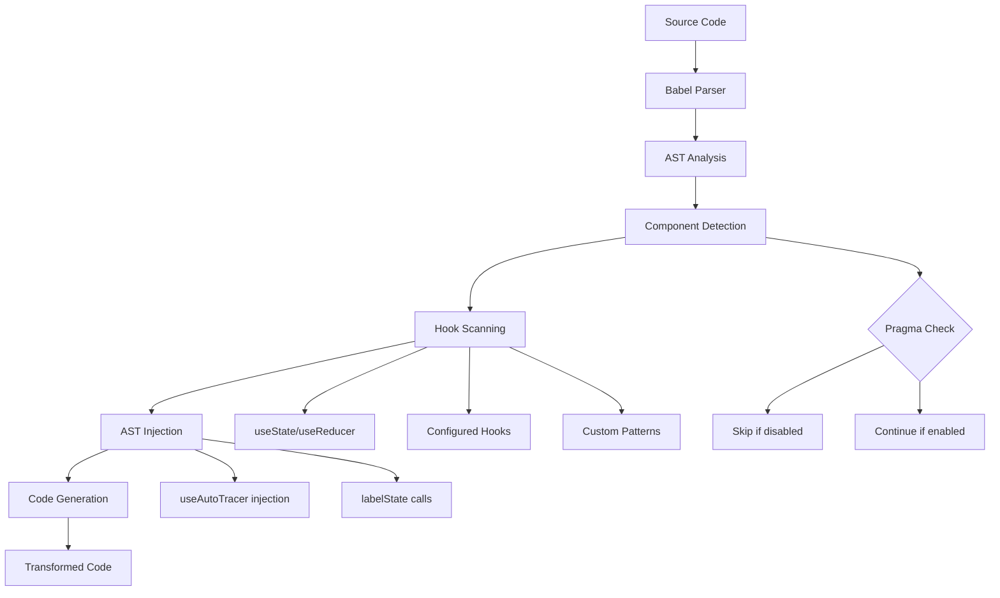

# Auto Tracer Inject Core

Shared AST transformation logic for automatically injecting `useAutoTracer` hooks into React components during build time.

## Overview

This package provides the core Babel AST transformation functionality used by the Auto Tracer ecosystem to automatically inject tracing hooks into React components. It analyzes TypeScript/JSX code, identifies React components, and injects `useAutoTracer` initialization along with `labelState` calls for configured hooks.

## Features

- **Automatic Component Detection**: Identifies React function components, arrow functions, and HOC-wrapped components
- **Hook Labeling**: Injects `labelState` calls for `useState`, `useReducer`, and configured custom hooks
- **Pragma Support**: Respects file-level and component-level tracing control pragmas
- **TypeScript Support**: Full TypeScript and JSX parsing support
- **Safe AST Manipulation**: Uses Babel's traversal API for safe, non-destructive code transformations

## Architecture



## Usage

### Basic Transformation

```typescript
import { transform } from "auto-tracer-inject-core";

const sourceCode = `
  function MyComponent() {
    const [count, setCount] = useState(0);
    const [name, setName] = useState('');
    return <div>{count} {name}</div>;
  }
`;

const result = transform(sourceCode, {
  filename: "MyComponent.tsx",
  config: {
    mode: "opt-out",
    importSource: "auto-tracer",
    labelHooks: ["useState"],
  },
});

console.log(result.code);
// Output:
// import { useAutoTracer } from 'auto-tracer';
// function MyComponent() {
//   const __autoTracer = useAutoTracer({ name: "MyComponent" });
//   const [count, setCount] = useState(0);
//   __autoTracer.labelState("count", 0);
//   const [name, setName] = useState('');
//   __autoTracer.labelState("name", 1);
//   return <div>{count} {name}</div>;
// }
```

### Configuration Options

```typescript
interface TransformConfig {
  /** Controls component selection mode */
  mode: "opt-in" | "opt-out";

  /** Module to import useAutoTracer from */
  importSource: string;

  /** Glob patterns for files to include */
  include: string[];

  /** Glob patterns for files to exclude */
  exclude: string[];

  /** Specific hook names to label */
  labelHooks: string[];

  /** Regex pattern for matching hook names */
  labelHooksPattern?: string;
}
```

### Pragma Control

Control tracing behavior using special comments:

```typescript
// File-level control
// @trace - Enable tracing for this file (opt-in mode)
// @trace-disable - Disable tracing for this file

function MyComponent() {
  // Component-level control
  // @trace - Enable tracing for this component
  // @trace-disable - Disable tracing for this component

  const [state, setState] = useState();
  // ...
}
```

## API Reference

### `transform(code, context)`

The main transformation function.

**Parameters:**

- `code: string` - Source code to transform
- `context: TransformContext` - Transformation context with filename and config

**Returns:** `TransformResult`

- `code: string` - Transformed source code
- `injected: boolean` - Whether tracing was injected
- `components: ComponentInfo[]` - Information about detected components

### Hook Labeling Rules

1. **Built-in Hooks**: `useState` and `useReducer` are always labeled
2. **Configured Hooks**: Hooks listed in `labelHooks` are labeled
3. **Pattern Matching**: Hooks matching `labelHooksPattern` regex are labeled
4. **Exclusion**: `useAutoTracer` calls are never labeled

### Component Detection

Supports detection of:

- Function declarations: `function MyComponent() {}`
- Arrow function expressions: `const MyComponent = () => {}`
- Function expressions: `const MyComponent = function() {}`
- HOC-wrapped components: `memo()`, `forwardRef()`, etc.

## Technical Details

### AST Transformation Process

1. **Parsing**: Source code is parsed into Babel AST with TypeScript/JSX support
2. **Traversal**: AST is traversed to identify React components and existing tracing setup
3. **Analysis**: Component bodies are scanned for hook declarations
4. **Injection**: `useAutoTracer` initialization and `labelState` calls are injected
5. **Generation**: Modified AST is converted back to source code

### Safety Features

- **Non-destructive**: Original code structure is preserved
- **Idempotent**: Multiple transformations don't create duplicates
- **Error handling**: Parse/transform errors return original code unchanged
- **Pragma respect**: Honors disable pragmas to prevent unwanted injection

### Performance Considerations

- **Lazy evaluation**: Hook scanning only occurs for detected components
- **Early termination**: Stops processing when pragmas disable tracing
- **Minimal AST manipulation**: Uses Babel's path-based APIs for efficiency

## Integration

This package is used by:

- **auto-tracer-plugin-vite**: Vite plugin for build-time injection
- **auto-tracer**: Runtime tracing library

## Development

```bash
# Install dependencies
pnpm install

# Run tests
pnpm test

# Build package
pnpm build

# Run tests in watch mode
pnpm run _test
```

## Testing

The package includes comprehensive unit tests covering:

- Component detection for various patterns
- Hook labeling with different configurations
- Pragma control behavior
- Edge cases and error handling
- AST transformation correctness

Run tests with:

```bash
pnpm test
```

## License

See root package.json for license information.
