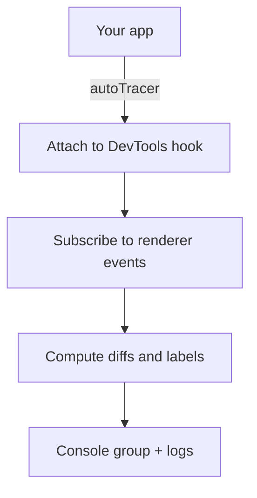

<p align="center">
  <a aria-label="npm version" href="https://www.npmjs.com/package/auto-tracer">
    
  </a>
  <a aria-label="npm types" href="https://www.npmjs.com/package/auto-tracer">
    
  </a>
</p>

# auto-tracer

React render tracing for humans. This package attaches to the React DevTools hook and prints structured logs for component render cycles and labeled state/prop changes. It’s framework-agnostic at runtime and works with both Vite and Next.js apps.

Important: autoTracer() performs the tracing. useAutoTracer is a helper hook that improves labeling and is typically auto-injected by a build plugin.

## Quickstart

Initialize before React renders on the client.

```ts
import { autoTracer } from "@auto-tracer/react18";
import { createRoot } from "react-dom/client";
import App from "./App";

// Start tracing early
const stopTracing = autoTracer();

createRoot(document.getElementById("root")!).render(<App />);

// Later, if needed:
// stopTracing();
```

## Options

```ts
const stop = autoTracer({
  enabled: true,
  includeReconciled: false,
  includeSkipped: false,
  showFlags: false,
  enableAutoTracerInternalsLogging: true,
  maxFiberDepth: 100,
  includeNonTrackedBranches: false,
  /**
   * Detects re-renders where the new value is structurally identical to the previous
   * value but with a different reference (e.g. re-created arrays, objects, inline
   * functions). When true a warning line is logged:
   *   "⚠️ State change filteredTodos (identical value): [] → []"
   * Uses stable JSON stringification for deep equality (including circular markers).
   */
  detectIdenticalValueChanges: true,
});
```

Removed legacy option:

```diff
- showFunctionContentOnChange: false
```

The formatting no longer short-circuits functions; values are always safely stringified.

Live updates

```ts
import {
  updateAutoTracerOptions,
  isAutoTracerInitialized,
} from "@auto-tracer/react18";

if (isAutoTracerInitialized()) {
  updateAutoTracerOptions({ showFlags: true });
}
```

## What you’ll see

- Component render cycle …
- State change <label>: <old> → <new>

Labels come from the helper hook useAutoTracer, which can be auto-injected into your components by our Babel/Vite plugins. Without injection, you still get lifecycle logs but with fewer labels.

### Identical value warnings

When `detectIdenticalValueChanges` is `true` (default) a value change with a different reference but identical deep content logs a warning line with a shared icon (⚠️) and the `(identical value)` suffix:

```
│   ⚠️ State change filteredTodos (identical value): [] → []
│   ⚠️ Prop change items (identical value): [1,2,3] → [1,2,3]
```

Distinct color/style buckets are applied internally for state vs prop identical warnings, inheriting the base theme hues.

## API

Contract

- autoTracer(options?): () => void
  - Starts tracing; returns a stop function.
- updateAutoTracerOptions(partial): void
  - Changes options at runtime.
- isAutoTracerInitialized(): boolean
  - Returns true if tracing is currently active.
- useAutoTracer(labels?): Helper hook returning a logger. Optional; intended for build-time injection.

Type notes

- All TypeScript is strict. No casts.
- Options include bounds checking (e.g., maxFiberDepth practical range 20–1000).

## Integration guides

Vite

- Call autoTracer() at the very top of src/main.tsx before createRoot().
- To get labeled logs automatically, enable packages/auto-tracer-plugin-vite in your Vite config.

Next.js

- Add the Babel plugin (packages/@auto-tracer/plugin-babel-react18) to auto-inject labels in client components.
- Ensure autoTracer() executes on the client before components mount.
  - Pages Router: initialize in pages/\_app.tsx.
  - App Router: include a minimal "use client" bootstrap component rendered first that runs autoTracer().
  - SSR cannot be traced; hydration and subsequent renders are.

## Internals overview



The auto-tracer-inject-core with Babel/Vite plugins augments your source so useAutoTracer can expose variable names and hook labels in these logs.

## Troubleshooting

- No logs? Verify autoTracer() runs before React renders and that you're in a client context.
- Unlabeled logs? Ensure the injection plugin is configured and active in your build.
- Too verbose? Tweak options like includeReconciled/includeSkipped and maxFiberDepth.
- Seeing repeated identical value warnings? Consider memoization (React.memo, useMemo, useCallback) or stable selectors.
- Seeing "State change unknown" in third-party components? This is expected behavior. Third-party libraries (e.g., MUI's ButtonBase) use internal state hooks that aren't labeled because they're not transformed by the build plugin. The tracer correctly detects the state changes but can't provide meaningful labels since it only transforms your source code, not node_modules.

## License

MIT
