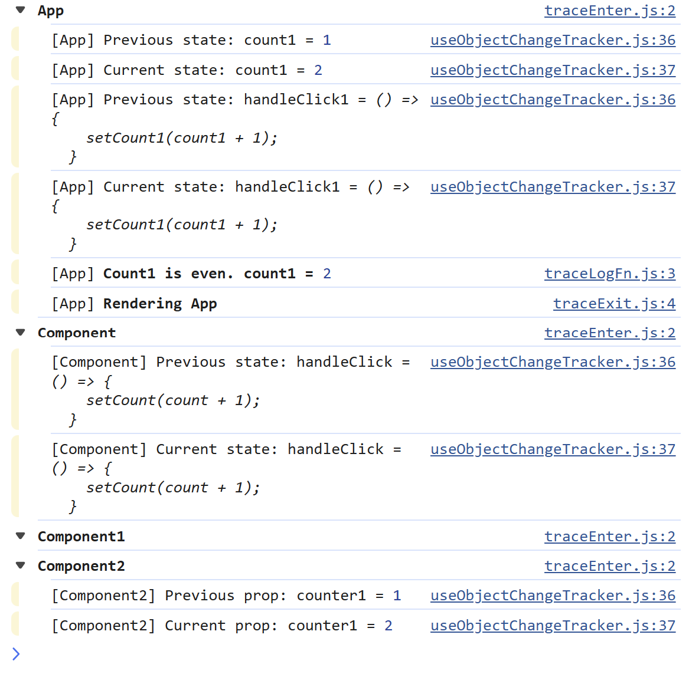

<p align="center">
  <a aria-label="npm version" href="https://www.npmjs.com/package/use-trace">
    
  </a>
  <a aria-label="npm types" href="https://www.npmjs.com/package/use-trace">
    
  </a>
</p>

# useTrace

## Tracing Library to understand state changes

This library is built to help understanding state changes triggering rerenders.
The gihub project contains an example project using the library.

### Output

<p>
  
</p>
State is any variables you pass to the state function.

Props is any props you pass to the hook.

## Usage

### Initialization

Initialize the trace in the first line of the component.

```typescript
function App() {
const trace = useTrace("App");
```

Optionally pass the props:

```typescript
function MyComponent({hello, world}) {
const trace = useTrace("MyComponent", {hello, world});
```

Alt:

```typescript
const MyComponent = (props: MyComponentProps) => {
const trace = useTrace("MyComponent", props);
```

The trace will let you know what the initial props is, and always when the props changes.

### Internal state

Log the internal state changes using the state function. Once per component/function.

```typescript
trace.state({ value1, object1, functionA });
```

Whenever one or many of the fields change, you will get notified about the previous and current value.

### Exit

On all exit points you need to call exit.

```typescript
trace.exit();
```

You can also add an optional log statement.

```typescript
trace.exit("Rendering loading spinner");
```

### Log statements

```typescript
trace.log(
  "This statement is indented at the current function level, and bold by default"
);
```

The function signature is identical to console.log.
